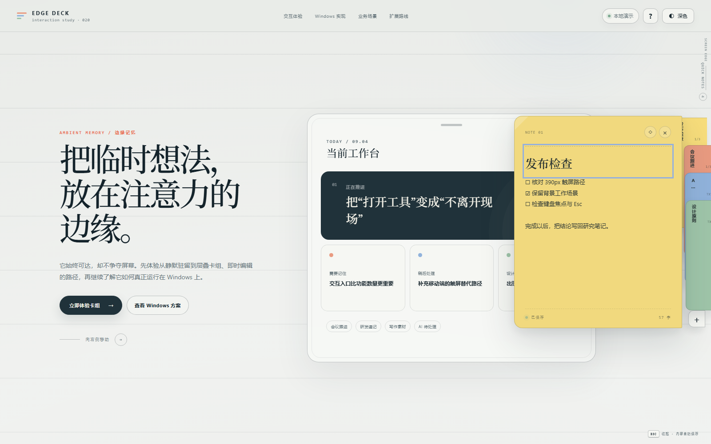
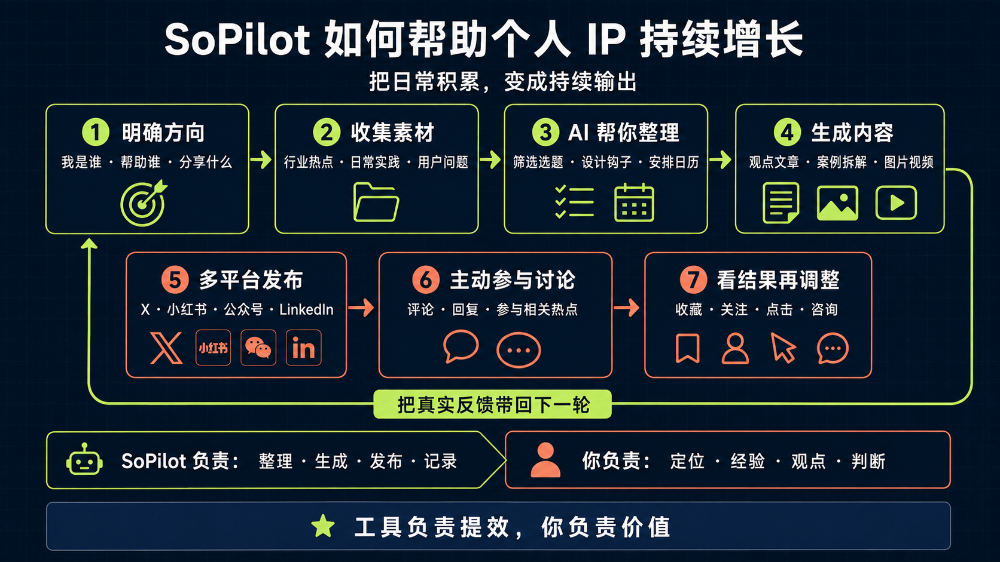
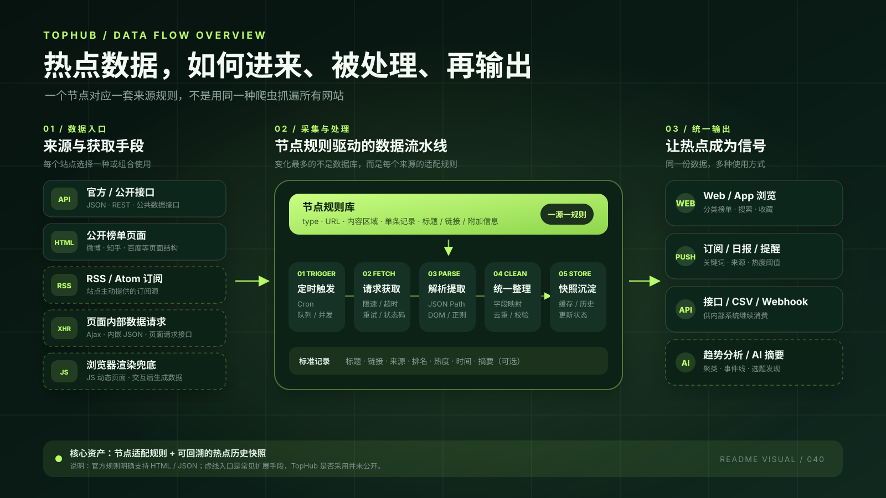
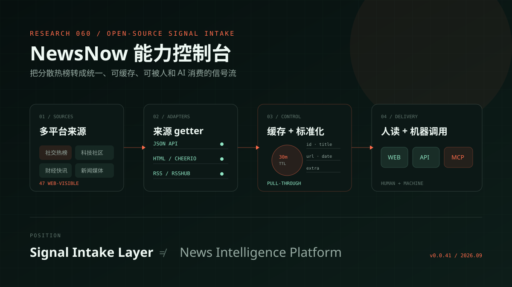
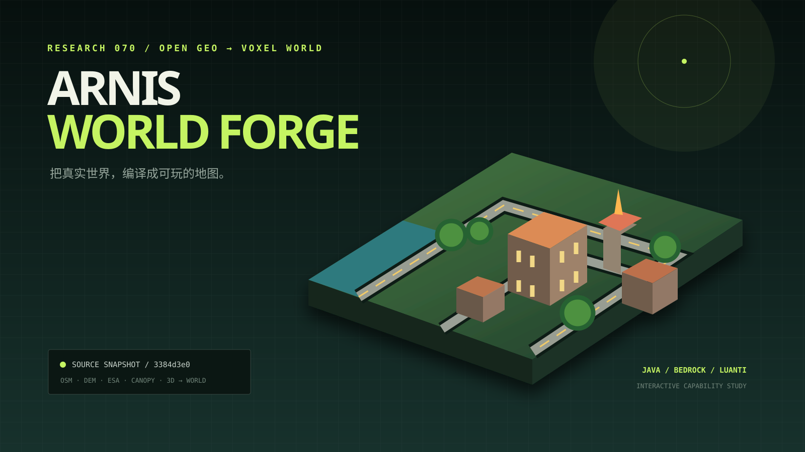
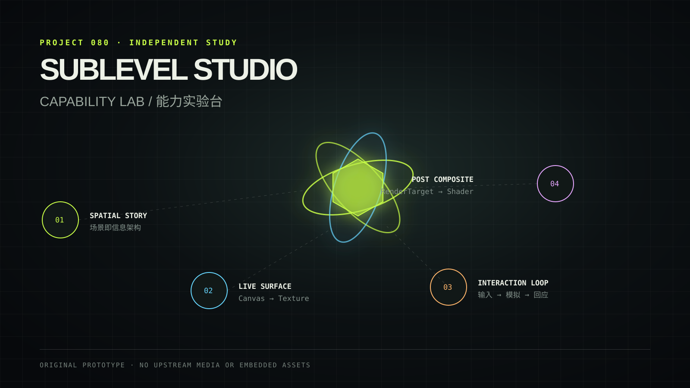
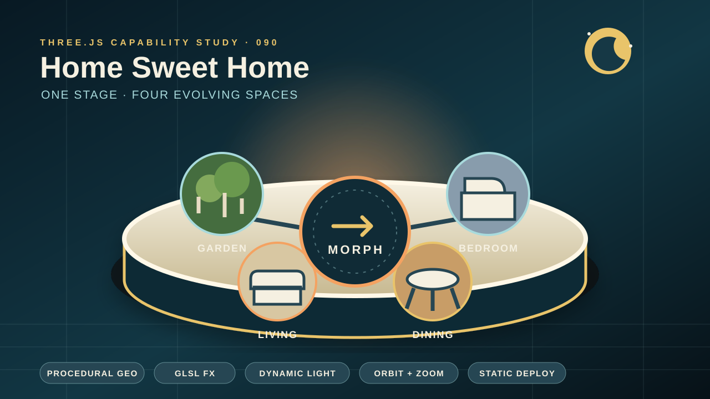
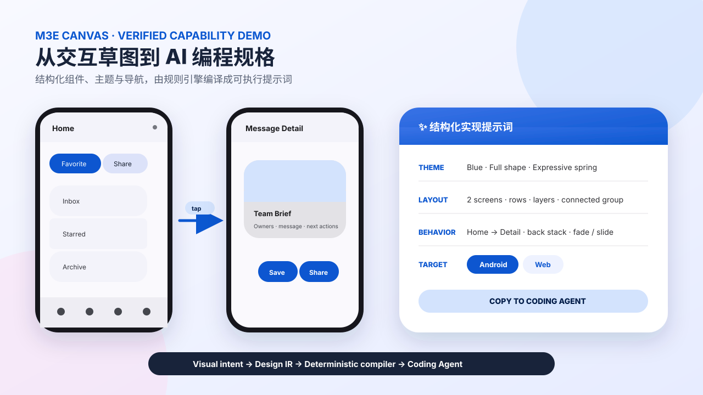
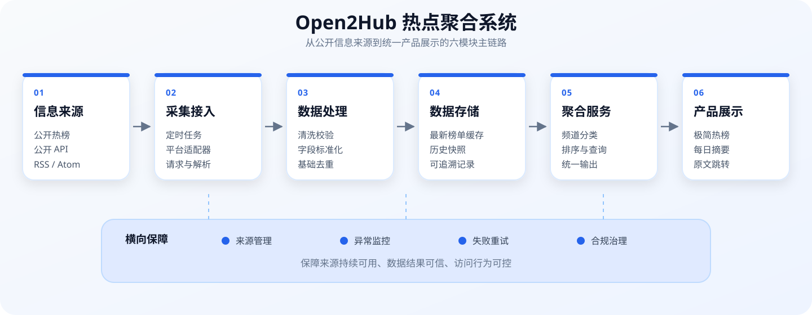
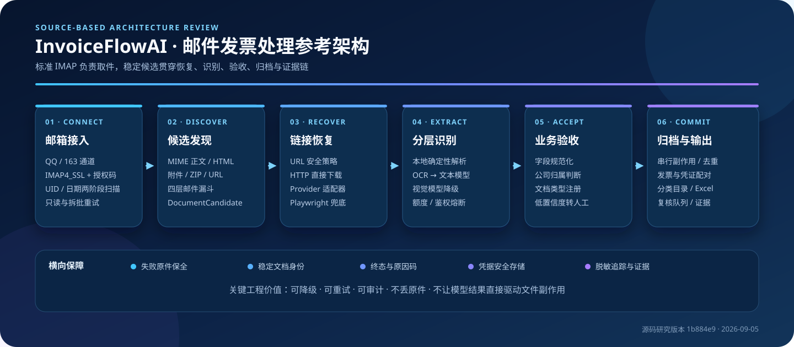

# GitHub 优秀项目研究库

这里集中整理近期遇到的优秀 GitHub 项目，记录它们解决的问题、关键设计、实现思路、可复用经验与实际验证结果。

仓库既是研究档案，也是导航入口：根目录 README 提供摘要和有序索引；每个子项目保留独立研究笔记、图片说明与相关材料；需要交互展示的项目可以链接到各自的在线 Demo。

## 在线总入口

[打开 GitHub 项目研究档案](https://yydshly.github.io/0904_codex_project/)：所有项目统一从这里进入；每个项目分别提供源仓库、研究笔记和在线 Demo。Demo 既可以部署在本站子路径，也可以指向独立部署地址。

## 项目索引

<!-- PROJECT_INDEX_START -->

| 顺序 | 源项目 | 摘要 | 状态 | 研究笔记 | 在线演示 |
| ---: | --- | --- | --- | --- | --- |
| 010 | [CLIProxyAPI](https://github.com/router-for-me/CLIProxyAPI) | 统一协议网关 + 凭证运行时：通过协议与 Provider 适配器，将调用方使用的统一 API 路由到后台真实的 API Key 或 OAuth/Auth 凭证，并完成上游模型交互。 | 已发布 | [查看笔记](projects/010-cliproxyapi/README.md) | [打开 Demo](https://yydshly.github.io/0904_codex_project/projects/010-cliproxyapi/demo/) |
| 020 | [Noty Edge Deck](https://github.com/aimen08/noty) | 把屏幕边缘的低打扰交互抽象为可运行 Web Demo，并给出 Windows 常驻工具的实现架构、业务适配判断与 P0–P3 扩展路线。 | 已发布 | [查看笔记](projects/020-noty-edge-deck/README.md) | [打开 Demo](https://yydshly.github.io/0904_codex_project/projects/020-noty-edge-deck/demo/) |
| 030 | [SoPilot 增长逻辑解剖台](https://sopilot.net/zh) | 用交互飞轮与系统分层图拆解 SoPilot 如何连接热点、持续内容、钩子、互动分发和浏览器自动化。 | 已发布 | [查看笔记](projects/030-sopilot-growth-logic/README.md) | [打开 Demo](https://yydshly.github.io/0904_codex_project/projects/030-sopilot-growth-logic/demo/) |
| 040 | [TopHub 能力图谱](https://tophub.today/) | 说明公开 HTML、JSON 与扩展入口如何经过节点规则、周期采集、字段整理和历史快照，转化为浏览、提醒及 API 等热点信号服务。 | 已发布 | [查看笔记](projects/040-tophub-capability-atlas/README.md) | [打开 Demo](https://yydshly.github.io/0904_codex_project/projects/040-tophub-capability-atlas/demo/) |
| 050 | [course2md 视频图文时间轴](https://github.com/mizorewww/course2md) | 本地优先的视频图文时间轴工具：并行提取稳定关键帧与字幕或 ASR 文本，按时间戳合并为可追溯的 Markdown、HTML 和结构化 JSON。 | 已发布 | [查看笔记](projects/050-course2md/README.md) | — |
| 060 | [NewsNow 能力控制台](https://github.com/ourongxing/newsnow) | 把多源热榜拆解为来源适配、缓存门控、字段标准化和 Web/API/MCP 交付，明确它作为外部信号输入层的价值与边界。 | 已发布 | [查看笔记](projects/060-newsnow-capability-console/README.md) | [打开 Demo](https://yydshly.github.io/0904_codex_project/projects/060-newsnow-capability-console/demo/) |
| 070 | [Arnis World Forge](https://github.com/louis-e/arnis) | 把开放地理数据到 Minecraft / Luanti 世界的编译流水线，拆解为地形、城市语义、生态地表、世界细节和多格式写出，并提供可复制的 CLI 配置实验室。 | 已发布 | [查看笔记](projects/070-arnis-worldforge/README.md) | [打开 Demo](https://yydshly.github.io/0904_codex_project/projects/070-arnis-worldforge/demo/) |
| 080 | [Sublevel Studio 能力实验台](https://github.com/MengTo/sublevel-studio) | 把一个高密度 Three.js 作品集拆解为空间叙事、实时纹理、可玩反馈与 Shader 后期，并用独立原型验证可迁移机制。 | 已发布 | [查看笔记](projects/080-sublevel-studio/README.md) | [打开 Demo](https://yydshly.github.io/0904_codex_project/projects/080-sublevel-studio/demo/) |
| 090 | [Home Sweet Home 四态空间 Morph](https://github.com/iamtechartist/home-sweet-home) | 用同一座 Three.js 微缩舞台展示花园、客厅、餐厅和卧室的连续换景，以及程序化几何、Shader 动效和昼夜光照能力。 | 已发布 | [查看笔记](projects/090-home-sweet-home/README.md) | [打开 Demo](https://yydshly.github.io/0904_codex_project/projects/090-home-sweet-home/demo/) |
| 100 | [M3E Canvas](https://github.com/lnkiai/m3e-canvas) | 把 Material 3 Expressive 多屏草图、主题与交互编译成面向 Coding Agent 的结构化实现提示词，并提供可点击预览与可导入演示工程。 | 已发布 | [查看笔记](projects/100-m3e-canvas/README.md) | [打开 Demo](https://lnkiai.github.io/m3e-canvas/) |
| 110 | [Open2Hub 热榜聚合架构](https://top.open2hub.com/) | 以 Open2Hub 的 REBANG 热榜为研究对象，将公开信息聚合能力整理为来源、采集、处理、存储、聚合服务与产品展示六个模块。 | 已发布 | [查看笔记](projects/110-open2hub/README.md) | — |
| 120 | [InvoiceFlowAI 邮件发票处理架构](https://github.com/EthanYoQ/Invoice-Downloader) | 将邮箱驱动的发票整理拆解为 IMAP 接入、MIME 候选发现、链接恢复、分层识别、业务验收、串行归档与人工复核，为类似文档自动化系统提供可复用参考架构。 | 已发布 | [查看笔记](projects/120-invoiceflowai/README.md) | — |

### 项目图文速览

#### 010 · [CLIProxyAPI](projects/010-cliproxyapi/README.md)

<a href="projects/010-cliproxyapi/README.md"></a>

> 统一协议网关 + 凭证运行时：通过协议与 Provider 适配器，将调用方使用的统一 API 路由到后台真实的 API Key 或 OAuth/Auth 凭证，并完成上游模型交互。

**状态：** 已发布 · [源项目](https://github.com/router-for-me/CLIProxyAPI) · [完整研究笔记](projects/010-cliproxyapi/README.md) · [在线演示](https://yydshly.github.io/0904_codex_project/projects/010-cliproxyapi/demo/)

---

#### 020 · [Noty Edge Deck](projects/020-noty-edge-deck/README.md)

<a href="projects/020-noty-edge-deck/README.md"></a>

> 把屏幕边缘的低打扰交互抽象为可运行 Web Demo，并给出 Windows 常驻工具的实现架构、业务适配判断与 P0–P3 扩展路线。

**状态：** 已发布 · [源项目](https://github.com/aimen08/noty) · [完整研究笔记](projects/020-noty-edge-deck/README.md) · [在线演示](https://yydshly.github.io/0904_codex_project/projects/020-noty-edge-deck/demo/)

---

#### 030 · [SoPilot 增长逻辑解剖台](projects/030-sopilot-growth-logic/README.md)

<a href="projects/030-sopilot-growth-logic/README.md"></a>

> 用交互飞轮与系统分层图拆解 SoPilot 如何连接热点、持续内容、钩子、互动分发和浏览器自动化。

**状态：** 已发布 · [源项目](https://sopilot.net/zh) · [完整研究笔记](projects/030-sopilot-growth-logic/README.md) · [在线演示](https://yydshly.github.io/0904_codex_project/projects/030-sopilot-growth-logic/demo/)

---

#### 040 · [TopHub 能力图谱](projects/040-tophub-capability-atlas/README.md)

<a href="projects/040-tophub-capability-atlas/README.md"></a>

> 说明公开 HTML、JSON 与扩展入口如何经过节点规则、周期采集、字段整理和历史快照，转化为浏览、提醒及 API 等热点信号服务。

**状态：** 已发布 · [源项目](https://tophub.today/) · [完整研究笔记](projects/040-tophub-capability-atlas/README.md) · [在线演示](https://yydshly.github.io/0904_codex_project/projects/040-tophub-capability-atlas/demo/)

---

#### 050 · [course2md 视频图文时间轴](projects/050-course2md/README.md)

<a href="projects/050-course2md/README.md"></a>

> 本地优先的视频图文时间轴工具：并行提取稳定关键帧与字幕或 ASR 文本，按时间戳合并为可追溯的 Markdown、HTML 和结构化 JSON。

**状态：** 已发布 · [源项目](https://github.com/mizorewww/course2md) · [完整研究笔记](projects/050-course2md/README.md)

---

#### 060 · [NewsNow 能力控制台](projects/060-newsnow-capability-console/README.md)

<a href="projects/060-newsnow-capability-console/README.md"></a>

> 把多源热榜拆解为来源适配、缓存门控、字段标准化和 Web/API/MCP 交付，明确它作为外部信号输入层的价值与边界。

**状态：** 已发布 · [源项目](https://github.com/ourongxing/newsnow) · [完整研究笔记](projects/060-newsnow-capability-console/README.md) · [在线演示](https://yydshly.github.io/0904_codex_project/projects/060-newsnow-capability-console/demo/)

---

#### 070 · [Arnis World Forge](projects/070-arnis-worldforge/README.md)

<a href="projects/070-arnis-worldforge/README.md"></a>

> 把开放地理数据到 Minecraft / Luanti 世界的编译流水线，拆解为地形、城市语义、生态地表、世界细节和多格式写出，并提供可复制的 CLI 配置实验室。

**状态：** 已发布 · [源项目](https://github.com/louis-e/arnis) · [完整研究笔记](projects/070-arnis-worldforge/README.md) · [在线演示](https://yydshly.github.io/0904_codex_project/projects/070-arnis-worldforge/demo/)

---

#### 080 · [Sublevel Studio 能力实验台](projects/080-sublevel-studio/README.md)

<a href="projects/080-sublevel-studio/README.md"></a>

> 把一个高密度 Three.js 作品集拆解为空间叙事、实时纹理、可玩反馈与 Shader 后期，并用独立原型验证可迁移机制。

**状态：** 已发布 · [源项目](https://github.com/MengTo/sublevel-studio) · [完整研究笔记](projects/080-sublevel-studio/README.md) · [在线演示](https://yydshly.github.io/0904_codex_project/projects/080-sublevel-studio/demo/)

---

#### 090 · [Home Sweet Home 四态空间 Morph](projects/090-home-sweet-home/README.md)

<a href="projects/090-home-sweet-home/README.md"></a>

> 用同一座 Three.js 微缩舞台展示花园、客厅、餐厅和卧室的连续换景，以及程序化几何、Shader 动效和昼夜光照能力。

**状态：** 已发布 · [源项目](https://github.com/iamtechartist/home-sweet-home) · [完整研究笔记](projects/090-home-sweet-home/README.md) · [在线演示](https://yydshly.github.io/0904_codex_project/projects/090-home-sweet-home/demo/)

---

#### 100 · [M3E Canvas](projects/100-m3e-canvas/README.md)

<a href="projects/100-m3e-canvas/README.md"></a>

> 把 Material 3 Expressive 多屏草图、主题与交互编译成面向 Coding Agent 的结构化实现提示词，并提供可点击预览与可导入演示工程。

**状态：** 已发布 · [源项目](https://github.com/lnkiai/m3e-canvas) · [完整研究笔记](projects/100-m3e-canvas/README.md) · [在线演示](https://lnkiai.github.io/m3e-canvas/)

---

#### 110 · [Open2Hub 热榜聚合架构](projects/110-open2hub/README.md)

<a href="projects/110-open2hub/README.md"></a>

> 以 Open2Hub 的 REBANG 热榜为研究对象，将公开信息聚合能力整理为来源、采集、处理、存储、聚合服务与产品展示六个模块。

**状态：** 已发布 · [源项目](https://top.open2hub.com/) · [完整研究笔记](projects/110-open2hub/README.md)

---

#### 120 · [InvoiceFlowAI 邮件发票处理架构](projects/120-invoiceflowai/README.md)

<a href="projects/120-invoiceflowai/README.md"></a>

> 将邮箱驱动的发票整理拆解为 IMAP 接入、MIME 候选发现、链接恢复、分层识别、业务验收、串行归档与人工复核，为类似文档自动化系统提供可复用参考架构。

**状态：** 已发布 · [源项目](https://github.com/EthanYoQ/Invoice-Downloader) · [完整研究笔记](projects/120-invoiceflowai/README.md)

<!-- PROJECT_INDEX_END -->

## 仓库结构

```text
.
├─ catalog/projects.json       # 项目顺序与摘要的唯一数据源
├─ projects/                   # 按 001、002……编号的研究目录
│  └─ _template/               # 新项目模板
├─ docs/                       # GitHub Pages 总览站点
├─ scripts/catalog.mjs         # 校验目录并同步 README / Pages 数据
└─ .github/workflows/          # 索引检查与 Pages 部署
```

## 收录一个新项目

1. 复制 `projects/_template` 为 `projects/NNN-project-slug`，例如 `projects/001-react`。
2. 完成该目录中的 `README.md`，并把封面放到 `images/cover.webp`（也支持 `.png`、`.jpg` 或 `.svg`）。
3. 在 `catalog/projects.json` 添加记录；`order` 必须唯一并与目录编号一致。
4. 运行 `npm run catalog:update` 生成根目录索引和 Pages 数据。
5. 运行 `npm run catalog:check` 做提交前检查。

项目状态统一使用：`queued`（待研究）、`researching`（研究中）、`published`（已发布）、`archived`（已归档）。

更详细的写作、图片和命名约定见 [projects/README.md](projects/README.md)。

## 在线展示

`docs/` 是零依赖的静态索引站点。推送到 `main` 后，GitHub Actions 会检查目录并发布 GitHub Pages。首次使用时，需要在仓库的 **Settings → Pages → Build and deployment** 中将 Source 设为 **GitHub Actions**。

每个子项目可以把 Demo 部署到任意地址，再将 URL 写入 `catalog/projects.json` 的 `demo` 字段；总览页会自动展示入口。
