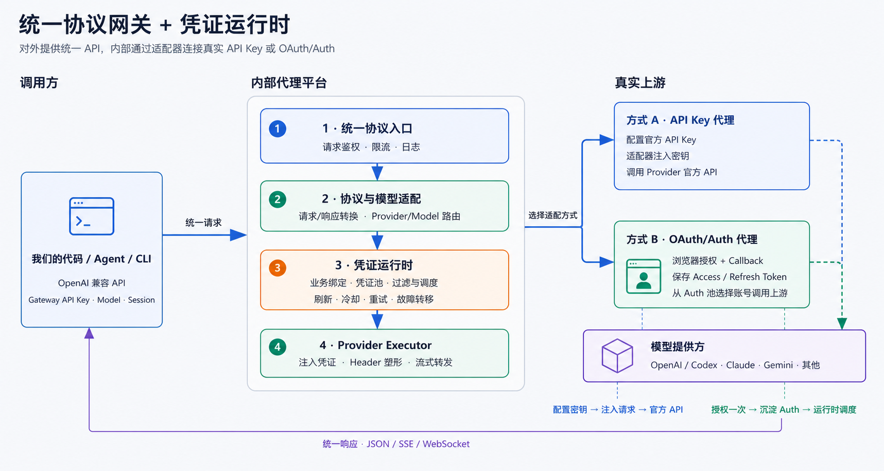

# GitHub 优秀项目研究库

这里集中整理近期遇到的优秀 GitHub 项目，记录它们解决的问题、关键设计、实现思路、可复用经验与实际验证结果。

仓库既是研究档案，也是导航入口：根目录 README 提供摘要和有序索引；每个子项目保留独立研究笔记、图片说明与相关材料；需要交互展示的项目可以链接到各自的在线 Demo。

## 在线总入口

[打开 GitHub 项目研究档案](https://yydshly.github.io/0904_codex_project/)：所有项目统一从这里进入；每个项目分别提供源仓库、研究笔记和在线 Demo。Demo 既可以部署在本站子路径，也可以指向独立部署地址。

## 项目索引

<!-- PROJECT_INDEX_START -->

| 顺序 | 源项目 | 摘要 | 状态 | 研究笔记 | 在线演示 |
| ---: | --- | --- | --- | --- | --- |
| 010 | [CLIProxyAPI](https://github.com/router-for-me/CLIProxyAPI) | 统一协议网关 + 凭证运行时：通过协议与 Provider 适配器，将调用方使用的统一 API 路由到后台真实的 API Key 或 OAuth/Auth 凭证，并完成上游模型交互。 | 已发布 | [查看笔记](projects/010-cliproxyapi/README.md) | [打开 Demo](projects/010-cliproxyapi/demo/) |
| 050 | [course2md 视频图文时间轴](https://github.com/mizorewww/course2md) | 本地优先的视频图文时间轴工具：并行提取稳定关键帧与字幕或 ASR 文本，按时间戳合并为可追溯的 Markdown、HTML 和结构化 JSON。 | 已发布 | [查看笔记](projects/050-course2md/README.md) | — |

<!-- PROJECT_INDEX_END -->

## CLIProxyAPI 快速理解

> **统一协议网关 + 凭证运行时：**通过协议与 Provider 适配器，将调用方使用的统一 API，转换并路由到后台真实的 API Key 或 OAuth/Auth 凭证，完成上游模型调用，再将响应转换回调用方协议。



- [完整研究笔记](projects/010-cliproxyapi/README.md)：能力、两种代理方式、Auth 形成、凭证调度、业务一对一/一对多、风险与源码索引。
- [在线交互知识页](https://yydshly.github.io/0904_codex_project/projects/010-cliproxyapi/demo/)：切换查看 API Key 和 OAuth/Auth 两条代理路径。
- [本地 OAuth + PKCE 实验](projects/011-oauth-pkce-flow-demo/README.md)：真实模拟浏览器 Redirect、Callback、Token 交换、过期与刷新，不连接真实账号。

## 仓库结构

```text
.
├─ catalog/projects.json       # 项目顺序与摘要的唯一数据源
├─ projects/                   # 按 001、002……编号的研究目录
│  └─ _template/               # 新项目模板
├─ docs/                       # GitHub Pages 总览站点
├─ scripts/catalog.mjs         # 校验目录并同步 README / Pages 数据
└─ .github/workflows/          # 索引检查与 Pages 部署
```

## 收录一个新项目

1. 复制 `projects/_template` 为 `projects/NNN-project-slug`，例如 `projects/001-react`。
2. 完成该目录中的 `README.md`，并把封面放到 `images/cover.webp`（也支持 `.png`、`.jpg` 或 `.svg`）。
3. 在 `catalog/projects.json` 添加记录；`order` 必须唯一并与目录编号一致。
4. 运行 `npm run catalog:update` 生成根目录索引和 Pages 数据。
5. 运行 `npm run catalog:check` 做提交前检查。

项目状态统一使用：`queued`（待研究）、`researching`（研究中）、`published`（已发布）、`archived`（已归档）。

更详细的写作、图片和命名约定见 [projects/README.md](projects/README.md)。

## 在线展示

`docs/` 是零依赖的静态索引站点。推送到 `main` 后，GitHub Actions 会检查目录并发布 GitHub Pages。首次使用时，需要在仓库的 **Settings → Pages → Build and deployment** 中将 Source 设为 **GitHub Actions**。

每个子项目可以把 Demo 部署到任意地址，再将 URL 写入 `catalog/projects.json` 的 `demo` 字段；总览页会自动展示入口。
