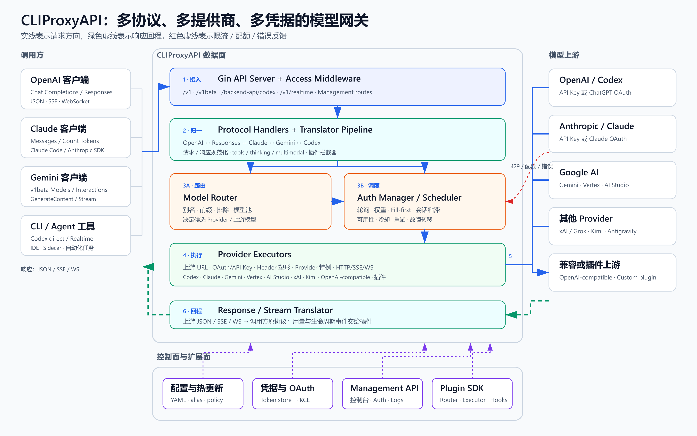

# CLIProxyAPI：统一协议网关 + 凭证运行时

> 通过协议与 Provider 适配器，将调用方使用的统一 API，转换并路由到后台真实的 API Key 或 OAuth/Auth 凭证，完成上游模型调用，再将响应转换回调用方协议。


## 快速索引

| 想了解的问题 | 推荐入口 |
| --- | --- |
| 30 秒理解整体原理 | 上方宏观架构图与[在线演示](https://yydshly.github.io/0904_codex_project/projects/010-cliproxyapi/demo/) |
| API Key 与 OAuth/Auth 有什么不同 | [两种代理方式](#两种代理方式) |
| Auth 为什么能代表用户调用 | [OAuth Auth 本质](#oauth-auth-本质)与[本地 HTTP 实验](../011-oauth-pkce-flow-demo/README.md) |
| 凭证如何过滤、选择和调度 | [凭证运行时](#凭证运行时) |
| 一对一、一对多和 Session 如何关联 | [业务关系](#业务关系不是-oauth-state) |
| 是否有封号或安全风险 | [风险与边界](#风险与边界) |
| 具体代码实现在哪里 | [源码落点](#源码落点) |

## 30 秒理解

调用方——也就是我们的代码、Agent 或 CLI——只调用一个稳定的统一 API。内部代理平台把外部协议转换成目标 Provider 协议，确定模型和可用凭证，再交给专用 Executor 请求真实上游。调用方不需要知道本次实际使用的是哪一家 Provider、哪一份 API Key 或哪个 OAuth 账号。

这套系统最重要的抽象是：

```text
统一协议入口 + Provider 适配器 + 凭证运行时 + Provider Executor
```

## 两种代理方式

| 方式 | 核心链路 | 适合场景 |
| --- | --- | --- |
| API Key 代理 | 配置真实 API Key → 协议适配 → 注入厂商 Header → 调用官方 API | 正式 API 网关、BYOK、企业统一出口 |
| OAuth/Auth 代理 | 浏览器授权与 Callback → 换取并保存 Token → 形成 Auth → 运行时选择账号并注入 Access Token | CLI、桌面工具、用户委托授权、账号凭证池 |

两条路径对调用方可以暴露同一个 OpenAI 兼容 API；区别只存在于平台内部如何取得、管理和注入真实上游凭证。

## OAuth/Auth 本质

它不是读取或复制浏览器 Cookie。浏览器只负责让用户在认证提供方完成登录授权，再根据 HTTP 302 访问 Callback，将一次性的 `code + state` 交给代码。代码校验 state，并使用授权码和 PKCE verifier 请求 Token Endpoint，最终保存：

- `access_token`：短期访问上游。
- `refresh_token`：无需再次打开浏览器即可续期。
- 账号身份、过期时间和 Scope。
- 禁用、额度、冷却、错误等运行时状态。

这些数据组合成 Auth 对象。后续模型请求由代码直接携带 Token，浏览器阶段已经结束。

## 凭证运行时

一次业务请求的决策顺序应该是：

1. 使用 Gateway API Key 识别调用方和租户。
2. 得到该租户允许使用的 Key/Auth 凭证池。
3. 根据模型别名确定候选 Provider。
4. 排除禁用、过期、额度不足、处于冷却期或不支持该模型的凭证。
5. 使用 Round Robin、Weighted、Fill First 或 Session Affinity 选出具体 authID。
6. Executor 注入 API Key 或 Access Token，完成协议和 Header 适配并调用上游。
7. 根据 401、429、配额和网络错误刷新、冷却、重试或故障转移。

## 业务关系不是 OAuth state

- OAuth `state` 只用于关联一次登录申请与 Callback，验证完成后应立即失效。
- 严格一对一由服务端保存 `tenantId → authID` 实现。
- 一对多由 `tenantId → allowedAuthPool` 实现，Selector 只能在这个池内调度。
- Session Affinity 是 `(tenant, provider, model, sessionId) → authID` 的可过期软绑定，用于请求连续性，但不能替代业务权限关系。

## 风险与边界

- OAuth 登录成功只说明认证流程成立，不代表 Provider 允许把个人订阅转售或共享给其他用户。
- 多租户共享 Auth 会扩大关联风控和封号影响面；生产环境应优先使用官方 API、BYOK 或获得明确许可的 OAuth 集成。
- API Key、Access Token 和 Refresh Token 都必须加密存储、日志脱敏、支持撤销和审计。
- 客户端不能任意指定 authID；业务身份到允许凭证池的映射必须由服务端控制。
- 应针对 401、429、额度耗尽、账号禁用和 Refresh Token 失效设计明确的状态机与重试上限。

## 深入数据面

下面的详细图用于继续追踪 CLIProxyAPI 内部请求链路：



### 详细图说明

CLIProxyAPI 的核心不是普通的 HTTP 转发，而是一条双向适配流水线：

1. **统一入口**：Gin 服务暴露 OpenAI Chat/Responses、Claude Messages、Gemini `v1beta`、Codex 直连与 Realtime 等入口，并先完成客户端 API Key 校验、日志和请求上下文处理。
2. **协议归一与扩展钩子**：Handler 识别来源协议；Translator 在 OpenAI、OpenAI Responses、Claude、Gemini、Codex 等格式之间转换请求和响应；插件可在路由、翻译、鉴权前后及流式分片阶段介入。
3. **模型与凭据决策**：模型别名和模型池先确定候选 Provider，Auth Manager 再按轮询、权重、填满优先或会话粘滞选择可用凭据；限流、配额和上游错误会进入冷却、重试与故障转移逻辑。
4. **Provider 执行**：每类 Provider Executor 负责上游 URL、OAuth/API Key、专用 Header、请求细节与流式传输。它不是一个完全通用的转发器，而是一组持续适配各上游行为的驱动器。
5. **响应回程**：上游 JSON、SSE 或 WebSocket 事件被转换回调用方原本使用的协议，因此客户端通常不需要理解实际选中的 Provider。

控制面贯穿整条链路：YAML 配置及热更新定义路由策略；本地凭据存储和 OAuth 流程提供账号；Management API/控制台负责运维；插件 SDK 扩充 Provider、调度器、协议转换器、拦截器和用量处理器。

## 源码落点

本次图解基于上游 `v7.2.149`，commit `2a6b87aca083a5bf498ac1f68a1b636c500d7aaa`（获取于 2026-09-04）：

- API 入口与协议路由：[`internal/api/server_routes.go`](https://github.com/router-for-me/CLIProxyAPI/blob/2a6b87aca083a5bf498ac1f68a1b636c500d7aaa/internal/api/server_routes.go)
- Handler 到执行管理器的主链路：[`sdk/api/handlers/handlers_execution.go`](https://github.com/router-for-me/CLIProxyAPI/blob/2a6b87aca083a5bf498ac1f68a1b636c500d7aaa/sdk/api/handlers/handlers_execution.go)
- 多凭据选择策略：[`sdk/cliproxy/auth/selector.go`](https://github.com/router-for-me/CLIProxyAPI/blob/2a6b87aca083a5bf498ac1f68a1b636c500d7aaa/sdk/cliproxy/auth/selector.go)
- 重试、冷却与执行编排：[`sdk/cliproxy/auth/conductor_execution.go`](https://github.com/router-for-me/CLIProxyAPI/blob/2a6b87aca083a5bf498ac1f68a1b636c500d7aaa/sdk/cliproxy/auth/conductor_execution.go)
- 双向协议转换注册表：[`sdk/translator/registry.go`](https://github.com/router-for-me/CLIProxyAPI/blob/2a6b87aca083a5bf498ac1f68a1b636c500d7aaa/sdk/translator/registry.go)
- 内置 Provider Executor 注册：[`sdk/cliproxy/service_executors.go`](https://github.com/router-for-me/CLIProxyAPI/blob/2a6b87aca083a5bf498ac1f68a1b636c500d7aaa/sdk/cliproxy/service_executors.go)
- 插件扩展契约：[`sdk/pluginapi/types.go`](https://github.com/router-for-me/CLIProxyAPI/blob/2a6b87aca083a5bf498ac1f68a1b636c500d7aaa/sdk/pluginapi/types.go)

## 在线与本地演示

- [GitHub Pages 在线知识页](https://yydshly.github.io/0904_codex_project/projects/010-cliproxyapi/demo/)：静态展示整体架构，并可切换 API Key 与 OAuth/Auth 两条代理路径。
- [OAuth + PKCE 本地 HTTP 实验](../011-oauth-pkce-flow-demo/README.md)：使用两个本地 Go 服务真实演示 Redirect、Callback、Token 交换、Access Token 过期与刷新，不连接真实 OpenAI。

GitHub Pages 只能托管静态文件，因此线上路径演示不会保存或使用真实凭证；涉及 HTTP Callback 和服务端换 Token 的行为保留在本地实验中。

## 项目信息

- 原仓库：<https://github.com/router-for-me/CLIProxyAPI>
- 本地源码：`source/`（独立浅克隆，不纳入本研究库版本控制）
- 上游版本：`v7.2.149`
- 研究状态：已发布首轮研究与演示
- 主要技术：Go 1.26、Gin、OAuth 2.0/PKCE、SSE、WebSocket、YAML 热更新、插件 ABI/API
- 最后更新：2026-09-04

## 本地源码获取记录

```powershell
git clone --depth 1 --single-branch https://github.com/router-for-me/CLIProxyAPI.git source
git -C source rev-parse HEAD
git -C source describe --tags --always
```

实际结果为 commit `2a6b87a`、tag `v7.2.149`。当前已完成源码结构核验、宏观与详细架构图、OAuth/PKCE 本地实验和静态在线知识页；真实多凭证故障转移仍需要在符合 Provider 规则的测试账号环境中验证。

## 后续研究队列

- 追踪一次 OpenAI Responses 请求在 Handler、Translator、Auth Manager 与 Codex Executor 之间的完整调用栈。
- 用两份测试凭据验证 round-robin、session affinity、cooldown 和 retry 行为。
- 对比 Codex、Claude、Gemini Executor 的 OAuth 刷新、Header 塑形与流式响应差异。
- 梳理 Management API 和插件边界，评估生产部署所需的密钥托管、审计、指标与隔离能力。

## 图片说明

图片来源、生成方式与无障碍文字说明见 [images/README.md](images/README.md)。
