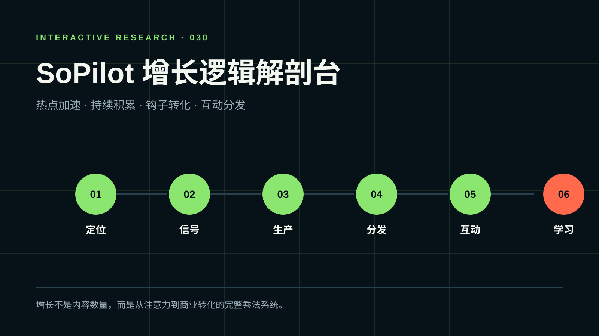
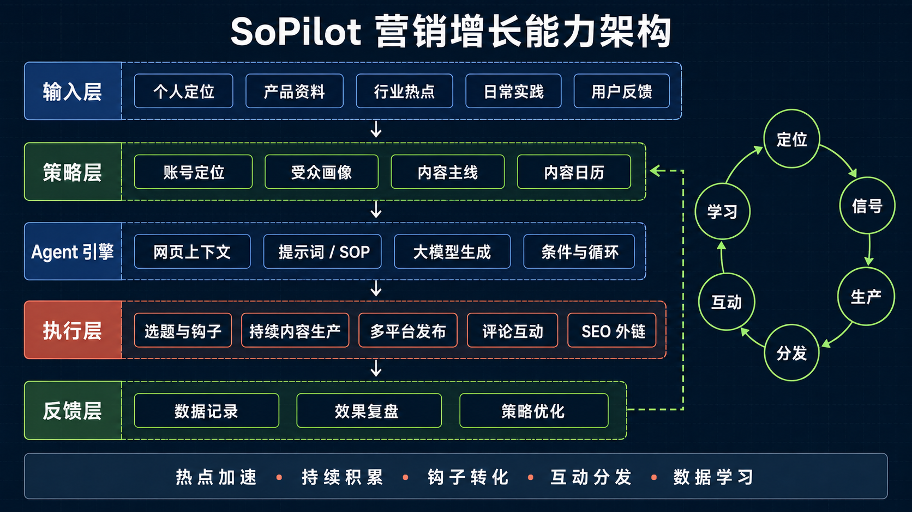

# SoPilot 营销增长逻辑

> 研究 SoPilot 如何把账号定位、热点信号、持续生产、互动分发与浏览器执行连接成可重复的增长工作流。



## 项目信息

- 研究对象：<https://sopilot.net/zh#home>
- 交互展示：[打开研究网页](demo/index.html)
- 研究状态：已发布
- 研究方法：官方产品页、帮助文档、Chrome Web Store 与平台政策交叉核对
- 最后更新：2026-09-05

## 直接结论

SoPilot 不是单纯的“爆款文案库”，而是一套面向个人创作者、独立开发者和小品牌的营销执行系统。它把大模型的内容理解与生成能力，连接到浏览器中的网页读取、表单填写、评论、发布和状态记录。

它的增长逻辑可以概括为：

```text
定位 → 发现信号 → 持续生产 → 多平台分发 → 主动互动 → 数据学习
```

但目前公开资料能够证明的闭环主要到“执行与记录”。是否会把曝光、点击、注册和收入等结果自动回流并优化下一轮策略，并没有得到公开文档支持。

## 能力流程：从日常积累到持续增长


这张图不解释技术，而是回答一个更直接的问题：**作为个人创作者，我每天具体怎样使用它？**

| 流程 | 白话说明 | SoPilot 的作用 |
| --- | --- | --- |
| 1. 明确方向 | 先确定我是谁、帮助谁、长期分享什么。 | 辅助梳理账号定位、受众和内容主线。 |
| 2. 收集素材 | 把行业热点、日常实践和用户问题放进同一个素材池。 | 提取网页和产品信息，发现相关内容信号。 |
| 3. AI 整理 | 从素材中筛选值得讲的主题，设计标题和发布节奏。 | 生成选题、钩子和内容日历。 |
| 4. 生成内容 | 将个人经验和观点做成文章、案例、图片或视频。 | 生成初稿和不同内容格式，人负责事实与判断。 |
| 5. 多平台发布 | 把同一份核心内容改成适合不同平台的表达。 | 适配 X、小红书、公众号、LinkedIn 等渠道并辅助发布。 |
| 6. 参与讨论 | 回复评论、回答问题，并进入与定位相关的热点讨论。 | 辅助发现目标帖子和生成上下文相关回复。 |
| 7. 看结果再调整 | 观察什么内容带来收藏、关注、点击或咨询。 | 保存执行记录；更完整的效果归因仍需补充数据工具。 |

因此，这套流程的分工是：**SoPilot 负责整理、生成、发布和记录；创作者负责定位、经验、观点和判断。**第七步产生的真实反馈应回到第一步，成为下一轮定位和选题的依据。

## 三个关键问题

### 1. 它是否依赖热点事件

是，但热点只是流量加速器。起爆帖监控和关键词搜索帮助账号发现正在升温的内容，并尽早进入评论区。其价值不是预测所有热点，而是寻找“热点与账号定位的交集”。

### 2. 它是否依赖持续发布

持续发布是基础盘。专栏定位、批量选题、正文生成和内容日历把不稳定的个人灵感变成可预测的内容供给，使账号主题更加集中，并降低每次创作的决策成本。

### 3. 它是否使用技巧型钩子

是。官方“爆款推文”能力强调情绪、结构、首句、钩子和话题标签。钩子可以改善停留和打开，但不能替代真实经验、独特观点和可信证据。

## 逻辑架构

下面的技术图用于解释上述流程在系统内部如何实现，适合放在 README 的“实现原理”部分，而不是作为第一页的能力介绍。



### 输入层

- 产品网址、产品资料与品牌信息；
- 当前网页标题、正文、描述、HTML 和特定 DOM 内容；
- 用户目标、平台、受众与营销任务。

### Agent 编排层

- 系统提示词定义角色、步骤和规则；
- 页面变量注入 `{title}`、`{content}` 或 CSS 选择器内容；
- `for`、`if` 与特殊函数完成轻量页面遍历和条件判断；
- 大模型负责理解上下文，生成文案或结构化表单数据。

### 浏览器执行层

- 内容脚本读取和定位网页元素；
- 把生成结果写入输入框或表单；
- 执行滚动、点击、发布等动作；
- 记录成功、失败、跳过和重复状态。

### 平台层

覆盖 X、小红书、微信公众号、LinkedIn、Facebook、Pinterest，以及目录站、博客和论坛等网页场景。

## 增长机制

可以用一个乘法模型理解：

```text
增长 ≈ 定位清晰度 × 内容质量 × 发布频率 × 互动触点 × 主页转化 × 留存
```

SoPilot 主要提升发布频率、互动触点和执行效率，也能辅助定位与内容质量。但产品价值、原创洞察、用户信任和最终转化仍由运营者负责。任何一个关键环节接近零，自动化都只会更快地放大问题。

## 风险与边界

- X 官方自动化规则明确反对非 API 的网页脚本自动化，并限制自动点赞和未经请求的批量回复；高频自动互动可能导致限流或封禁。
- Google 将自动程序创建的外链、低质量目录链接和带优化锚文本的论坛评论列为链接垃圾；外链建设需要以相关性和人工复核为前提。
- 浏览器扩展的页面读取与修改能力具有较高权限；企业使用前应确认数据范围、保留周期、模型供应商、子处理方和审计能力。
- 官网隐私政策较为概括，且正文仍出现其他产品名称，无法单凭该页面完成企业级隐私与合规判断。

## 可复用启发

1. 垂直 Agent 的价值来自“完成任务”，不只是生成答案。
2. 浏览器插件可以作为本地执行面，云端网站作为配置与资产控制面。
3. Prompt 只是起点；稳定运行还需要页面定位、状态、重试、去重和人工审批。
4. 真正的数据护城河来自“什么策略带来了什么商业结果”，而不是生成内容的数量。
5. 自动化强度必须和平台规则、品牌风险及用户预期共同设计。

## 参考资料

- [SoPilot 首页](https://sopilot.net/zh)
- [AI 营销工作台](https://sopilot.net/zh/workspace)
- [专栏内容创作](https://sopilot.net/zh/docs/content-column-guide)
- [创建和管理 SoPilot 智能体](https://sopilot.net/zh/docs/agent-create-guide)
- [全自动 X 互动](https://sopilot.net/zh/x-auto-engagement)
- [目录提交指南](https://sopilot.net/zh/docs/directory-submit-guide)
- [Chrome Web Store](https://chromewebstore.google.com/detail/sopilot-social-media-mark/fdglpcinfnlemkfmoggkcekcepniekgb)
- [X 自动化规则](https://help.x.com/en/rules-and-policies/x-automation)
- [Google 搜索垃圾内容政策](https://developers.google.com/search/docs/essentials/spam-policies)
- [Chrome 扩展权限说明](https://support.google.com/chrome_webstore/answer/186213)
- [SoPilot 隐私政策](https://sopilot.net/privacy)
