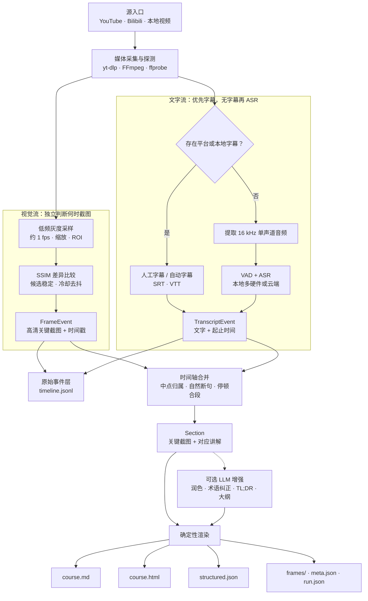

# course2md：视频图文时间轴工具

> 本地优先的视频内容结构化管线：并行提取稳定关键帧与字幕或 ASR 文本，通过时间戳合并成可阅读、可回看、可供程序消费的图文讲义。


## 项目信息

- 原仓库：<https://github.com/mizorewww/course2md>
- 审阅版本：[`v1.4.1 / 62ca551`](https://github.com/mizorewww/course2md/tree/62ca551335f2d7ba4711a65705cb4b81b12a54c9)
- 研究状态：已完成架构与能力梳理
- 主要技术：Rust、Tokio、FFmpeg、yt-dlp、Qwen3-ASR、llama.cpp、CoreML/MLX、OpenVINO、OpenAI-compatible API
- 最后更新：2026-09-05

## 摘要

`course2md` 不是单纯的视频摘要器，也不会根据字幕语义决定何时截图。它将一段视频拆成两条相互独立的处理流：视觉流以低频灰度采样、ROI 和 SSIM 相似度识别稳定画面变化，输出关键截图与时间戳；文字流优先解析平台或本地字幕，没有字幕时才提取音频并通过 VAD 与 ASR 生成带时间范围的转写。

两条流最终依靠共同的时间轴合并：每段文字按时间中点归入当时的截图，跨换页语音尽量在标点或空格处拆分，再按停顿组织成自然段。默认结果是“关键画面 + 对应讲解”的图文讲义；LLM 润色、结合截图纠正术语以及 TL;DR、要点和时间戳大纲均属于可选增强，而不是主流程的必要条件。

它的算法研究新颖性有限，主要是成熟工具和方法的工程组合；更值得参考的是本地优先、多硬件 ASR 后端、稳定画面状态机、断点续跑、原始事件保留与运行溯源。对于已经研究过 YouTube 视频抽取的团队，它更适合作为同类实现与工程细节样本，而不是新的核心研究方向。

## 架构数据流（Mermaid）

上方图片负责模块化概览；下面的 Mermaid 作为可维护的数据流说明，明确“视觉选图”和“字幕 / ASR”彼此独立，直到时间轴阶段才依靠时间戳配对。



## 一句话定位

> 把 YouTube、Bilibili 或本地视频转换成有时间证据的图文课程讲义，并同时产出可进入知识库或 RAG 管线的结构化数据。

## 从一个入口到最终输出

输入一个在线视频 URL 或本地视频文件后，系统依次完成：

1. 使用 `yt-dlp` 和 `ffprobe` 获取视频、标题、作者和时长；本地文件直接原地读取。
2. 视觉流扫描视频画面，识别稳定换页并提取高清 JPEG 关键帧。
3. 文字流优先读取人工字幕和自动字幕；没有字幕时才抽取 16 kHz 单声道音频并运行 ASR。
4. 将 `FrameEvent[]` 与 `TranscriptEvent[]` 写入原始时间线，并组织成“截图 + 讲解文字”的 `Section[]`。
5. 可选调用 LLM 润色字幕、参考截图纠正专有名词，并生成概述、核心要点和章节大纲。
6. 输出 Markdown、HTML、结构化 JSON、关键帧、元数据和运行溯源。

典型产物如下：

```text
out/<platform>/<title>/<id>/
├─ course.md          # 图文课程讲义
├─ course.html        # 可浏览的图文页面
├─ structured.json    # 程序可消费的 Section 数据
├─ timeline.jsonl     # 原始截图与文字事件
├─ frames/            # 高清关键截图
├─ audio.wav          # 无字幕、需要 ASR 时生成
├─ meta.json          # 视频标题、作者、时长等元数据
└─ run.json           # 版本、转写来源、模型和运行统计
```

## 核心能力

| 能力 | 实现方式 | 作用 |
| --- | --- | --- |
| 视频与元数据获取 | `yt-dlp`、`ffprobe` | 处理在线视频和本地文件，统一标题、作者、时长与来源 |
| 关键截图提取 | FFmpeg 低频灰度采样、ROI、SSIM、稳定状态机、冷却去抖 | 捕捉 PPT 换页和屏幕切换，过滤短暂动画与细小扰动 |
| 字幕优先 | 人工字幕 → 自动字幕 → ASR | 有现成字幕时跳过音频提取与模型推理 |
| 多后端 ASR | CoreML/MLX、llama.cpp GPU/CPU、OpenVINO NPU、云 API | 在隐私、硬件、速度、功耗和使用成本之间切换 |
| 图文时间对齐 | 语音中点归属截图，跨页时吸附到自然断句 | 将“老师说了什么”与“屏幕当时显示什么”放在同一章节 |
| 文本组织 | 按停顿和长度合并自然段，过滤独立语气词 | 避免输出 VAD 碎片流水账 |
| 可选 LLM 增强 | 文本润色、截图辅助术语纠正、长视频 map-reduce 总结 | 提升可读性，并生成 TL;DR、要点和时间戳大纲 |
| 可追溯与恢复 | `timeline.jsonl`、`run.json`、模型身份 checkpoint | 保留原始事件，支持中断恢复并避免混用不同模型结果 |

## 关键截图能力：是什么、为什么有意义

这里的“视频截取”不是把原视频剪成小视频，而是提取静态关键帧。截图选择也不依赖字幕含义：程序默认约每秒采样一个缩小后的灰度画面，计算它与上一已保留画面的 SSIM；当差异足够大、新画面保持稳定且满足最小截图间隔时，再回到对应时间点提取高清截图。

这个能力补足了纯转写缺失的视觉上下文。诸如“看右边这个模块”“下面这段代码”“图中的红色曲线”之类讲解，仅有字幕时无法还原指代；加入当时的屏幕画面后，内容才成为可独立阅读的课程材料。

它确实需要顺序读取和解码整段视频，但并不是逐帧运行视觉大模型：以一小时、30 fps 视频为例，原始视频约有 10.8 万帧，默认进入 SSIM 比较的约为 3,600 张低分辨率灰度帧，最终只保存几十到数百张高清关键帧。通常本地 ASR 的成本高于 SSIM 计算；有现成字幕时则可完全跳过 ASR。

## 为什么没有只按字幕时间反查图片

字幕时间只能提供候选位置，不能准确表示换页与画面稳定时间。老师可能先讲话后换页、先换页后停顿，也可能在一句话期间连续切换多张图。直接取字幕开头、中点或结尾，可能得到上一页或翻页动画。

另一方面，按每条字幕随机访问视频会产生大量重复截图；压缩视频还需要从附近关键帧开始解码，大量随机 seek 不一定比一次顺序扫描更便宜。更值得扩展的方案是“字幕语义提供候选窗口 + 窗口内视觉稳定检测 + 低频全局扫描防漏页”，而不是完全用字幕替代视觉判断。

## 底层设计取舍

- 确定性处理优先：采集、切分、对齐和原始事件落盘先完成，LLM 只作为后置增强。
- 时间戳是两条流的共同协议：视觉算法不需要理解语音语义，ASR 也不需要理解图像内容。
- 本地优先但允许云端：本地 ASR 可保持音频不离开设备；云 STT 会上传音频分块，LLM 润色会上传文本，视觉润色还会上传截图。
- 外部工具承担高变化领域：站点规则交给 `yt-dlp`，编解码交给 FFmpeg，Rust 负责数据契约、异步编排与容错。
- 原始数据与派生内容分层：原始事件保留在 `timeline.jsonl`，可读段落和 LLM 结果进入最终文档。

## 适用场景

适合：

- PPT 网课、企业培训和技术分享；
- 代码教程、产品演示和屏幕录制；
- 本地隐私敏感资料的转写与整理；
- 历史视频进入全文搜索、知识库或 RAG 前的预处理；
- 需要截图、文字和源视频时间点相互对应的学习资料。

不适合：

- 需要说话人分离、角色识别和行动项的多人会议；
- 电影、访谈和连续运动画面，容易产生无意义截图；
- 要求逐字准确、可作为法律或医疗证据的转写；
- 实时直播、在线协作或大规模队列处理；
- 需要搜索幻灯片内部文字的场景，当前没有完整 OCR 与版面理解。

## 可复用的工程经验

- 关键画面使用“上一输出画面—当前候选—稳定后发射”三状态，而不是发现差异立即截图。
- VAD 长语音段尽量在低能量点切分，并将事件时间与实际裁切范围分开，减少词语截断和重复文本。
- 图文对齐优先保证句子完整；跨页时找不到自然断点就保留整句，而不是按字符比例硬切。
- checkpoint 记录 provider、模型与分段配置，配置变化时主动废弃旧进度，防止不同模型结果混合。
- 原始事件、可读段落、LLM 派生内容和运行溯源分别保存，便于排错、复算和审计。

## 可扩展方向

1. 增加 OCR、版面、公式和代码块识别，使截图内容真正可搜索。
2. 引入词级时间戳、说话人分离、章节检测与人工校正界面。
3. 将 Source、ASR、Scene Detector 和 Renderer 抽象成稳定插件接口。
4. 基于 `structured.json` 增加全文搜索、向量索引、问答、测验、闪卡和知识图谱。
5. 增加播放列表、批量任务、服务端 API、队列、Webhook、监控和权限治理。
6. 使用字幕语义引导局部查帧，并保留低频全局扫描，降低长视频视觉处理成本。

## 我们的判断

`course2md` 对已经研究过 YouTube 视频信息提取的团队没有明显的算法研究增量：下载、字幕、音频、ASR、关键帧和 LLM 总结均是成熟能力组合。其价值主要集中在工程实现和端侧部署，而不是提出了新的内容理解方法。

因此不建议把它发展成新的核心研究课题，也不建议未经加固直接作为企业级生产平台。更合理的做法是将它保留为同类实现样本，重点吸收稳定画面检测、自然边界对齐、checkpoint 身份和运行溯源等设计；只有当现有系统缺少本地多硬件 ASR 或图文时间轴时，再考虑 fork 或进行内部 PoC。

## 本地验证与成熟度

- 在审阅提交上执行 `cargo test`：62 个测试通过。
- 执行合成视频场景测试：2 个测试通过，覆盖换页检测、真实出现时间与 stable 模式。
- 上游 CI 配置覆盖 Linux、macOS、Windows，并在非 Windows 环境执行合成视频测试。
- 项目首次提交为 2026-08-31，2026-09-03 已发布到 v1.4.1；迭代速度快，但项目历史和真实业务样本仍然有限。
- 上游性能基准主要来自三分钟课程片段，不应直接外推到不同语言、画面类型和长视频数据集。

## 已知边界

- 画面时间使用采样序号推算，可能存在不超过一个采样间隔的漂移。
- 平台字幕抓取默认偏好中文和英文，其他语言需要扩展配置。
- LLM 的 `temperature=0`、结构化输出和时间戳约束只能降低幻觉风险，不能消除幻觉。
- HTML 内联样式，但截图仍通过 `frames/...` 相对路径加载，并非真正的单文件 HTML。
- 云端 transcription 默认使用 OpenRouter 的 JSON `input_audio` 形式，不保证兼容所有标准 OpenAI multipart transcription 端点。
- 当前模块划分清楚，但 provider 与输出格式仍由核心代码枚举和分支控制，尚未形成外部插件体系。

## 图片说明

架构图的来源、许可和不依赖图片的文字说明记录在 [images/README.md](images/README.md)。

## 参考资料

- [项目 README](https://github.com/mizorewww/course2md/blob/62ca551335f2d7ba4711a65705cb4b81b12a54c9/readme.zh.md)
- [设计文档](https://github.com/mizorewww/course2md/blob/62ca551335f2d7ba4711a65705cb4b81b12a54c9/docs/DESIGN.md)
- [主流程编排](https://github.com/mizorewww/course2md/blob/62ca551335f2d7ba4711a65705cb4b81b12a54c9/src/pipeline.rs)
- [关键画面检测](https://github.com/mizorewww/course2md/blob/62ca551335f2d7ba4711a65705cb4b81b12a54c9/src/scene.rs)
- [ASR 后端与 VAD](https://github.com/mizorewww/course2md/blob/62ca551335f2d7ba4711a65705cb4b81b12a54c9/src/asr.rs)
- [图文时间轴合并](https://github.com/mizorewww/course2md/blob/62ca551335f2d7ba4711a65705cb4b81b12a54c9/src/timeline.rs)
- [输出渲染](https://github.com/mizorewww/course2md/blob/62ca551335f2d7ba4711a65705cb4b81b12a54c9/src/render.rs)
- [性能与功耗基准](https://github.com/mizorewww/course2md/blob/62ca551335f2d7ba4711a65705cb4b81b12a54c9/docs/BENCHMARKS.md)
