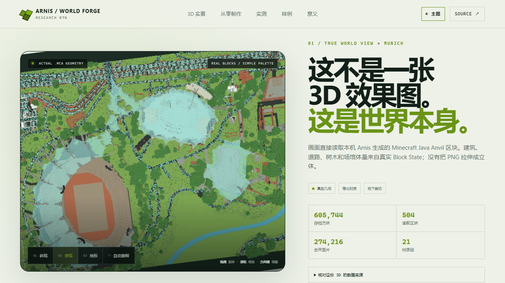

# Arnis World Forge



> 把真实世界的开放地理数据，编译为可玩的 Minecraft / Luanti 方块世界。

- 在线入口：[交互式 3D 与能力展示](https://yydshly.github.io/0904_codex_project/projects/070-arnis-worldforge/demo/#world-3d) · [下载本机生成的 Java 世界](https://yydshly.github.io/0904_codex_project/projects/070-arnis-worldforge/demo/assets/downloads/arnis-munich-olympiapark-java.zip)
- 上游仓库：[louis-e/arnis](https://github.com/louis-e/arnis) · 本项目只做研究、实跑验证和 Web 适配，不隶属于上游项目
- 本地快照：`main` / `3384d3e0` / Arnis `3.1.0`
- 许可：上游主代码 Apache-2.0；地理数据、3D 模型与素材需分别遵循上游 `NOTICE` 中的许可和署名要求
- 展示状态：已使用本地 Arnis CLI 生成真实 Java Anvil 世界，交付完整可安装 ZIP，并直接解析 `.mca` Block State 做成浏览器可交互 3D；PNG 仅作为预览与能力回退

## 结论先行

Arnis 不是地图查看器，也不是把一张地图图片拉成立体。它是一套**地理数据到方块世界的编译器**：输入经纬度范围或本地 OSM 数据，融合建筑、道路、水系、地形和地表信息，再输出可以继续编辑和游玩的世界存档。

它最直接的价值，是省去真实地点基础场景的大量手工搭建工作。生成结果本身只是底图；真正的产品价值来自后续加入的建筑精修、任务、教学内容、多人服务或网页交互。如果目标只是普通地图浏览或工程级测绘，Arnis 并不是合适工具。

## 真实 3D 展示

首屏不是根据图片推测出来的 3D。它读取本机 Arnis 生成的慕尼黑奥林匹克公园 Java 世界：

```text
.mca Region
  → zlib 解压 Chunk NBT
  → Section palette + packed Block State
  → 方块坐标与类型
  → 不可见面剔除 + 相邻面贪心合并
  → Three.js BufferGeometry
```

- 世界范围：445 × 278 blocks，`geo-only` / `0.5×`
- 构建证据：读取 504 个 Chunk、605,744 个非空气方块
- Web 资产：274,216 个合并后可见面片、21 个材质组、4.2 MiB 二进制网格
- 真实性边界：几何来自真实世界区块；网页使用按方块名映射的简化色板，不宣称复刻 Minecraft 原版纹理；深层地下被裁切以服务外部空间查看
- 操作：拖拽旋转、滚轮缩放、斜视/俯视/地标三种相机、方向键调整、自动旋转开关

### 实际交付：可安装的 Java 世界

首屏现在交付同一份慕尼黑世界的完整 ZIP，而不是额外编排一个与 Arnis 无关的网页任务：

- 221 个实际世界文件，原始体积 4.32 MiB，ZIP 下载体积 1.47 MiB
- 包含 `level.dat`、`region/r.0.0.mca`、`data/*.dat`、地图预览、图标和 `metadata.json`
- SHA-256：`9647798f0fd3e74f2281584b728262124520c0be77f05a98d3019584509228ef`
- 解压后把 `Arnis World 1` 放入 `%APPDATA%\.minecraft\saves`，在 Minecraft Java Edition 的“单人游戏”中打开

这才是 Arnis 的核心结果：3D 查看器只是下载前验收；ZIP 才是可以继续进入、编辑、添加玩法或部署到服务器的世界资产。包与 3D 网格都来自 `.runtime/sample-suite-20260904T181031Z/munich-olympiapark/worlds/Arnis World 1`。

### 地图生成后如何使用

生成后的同一份地图有两条使用路径：

1. **Minecraft 原生路径**：把世界目录放入 Java Edition 的 `saves`，进入后行走、飞行、放置或删除方块；再用命令、WorldEdit、数据包、Mod 或服务端插件加入任务与多人玩法。
2. **网页素材路径**：解析 `region/*.mca` 中的 Chunk、palette 和 Block State，执行可见面剔除与网格合并，再交给 Three.js。这样可以做成不依赖 Minecraft 客户端的浏览器导览、教学、游戏或编辑器。

如果长期目标是 Web 产品，更合理的架构是把 OSM、DEM 与地表数据先整理成通用场景中间表示，再分别导出 Minecraft 世界和 Web 3D；本项目现有的 Anvil 转换器证明了第二条路径可行，但它还不是完整的网页游戏或在线编辑器。

可重复导出：

```powershell
npm run world:web
npm run world:package
npm run viewer:bundle
```

实现入口：`scripts/export-world-web.mjs` 负责 Anvil/NBT 解析和网格导出；`scripts/package-world.mjs` 负责完整世界打包和 SHA-256 清单；`demo/world-viewer.js` 负责 Three.js 验收视图。

## 从零制作同类效果

1. **选择区域**：确定 bbox、比例和生成模式。城市全量使用 `geo-terrain`，平地城市可用 `geo-only`，纯 DEM 使用 `terrain-only`。
2. **生成世界**：运行 Arnis，让它获取地理数据并写出 `level.dat`、`region/*.mca`、Chunk 和 Block State。图片预览是可选副产物，不是下一步输入。
3. **解析存档**：读取 Region 头部定位 Chunk，按压缩类型解压 NBT，解析每个 Section 的 palette 与 64-bit packed block array。
4. **生成外部网格**：过滤空气，按邻居决定可见面，再合并同平面、同材质矩形；本项目用紧凑 `uint16-le` 二进制记录面方向、坐标、尺寸和材质。
5. **浏览器渲染**：用 Three.js 按材质创建 BufferGeometry，加入光照、雾、相机控制、响应式像素比、键盘与加载/错误回退。
6. **验证真实性**：保存源 `.mca`、bbox、方块/区块/面片统计；在浏览器与 Minecraft 中核对同一地标位置，避免把示意图冒充真实产物。

这两段职责必须分开：Arnis 完成“真实地理数据 → 游戏世界”；Web 适配器完成“已有游戏世界 → 浏览器 3D”。

## 真实运行证据

本项目已运行 Arnis 原库能力，而不只读取源码：

```powershell
target/debug/arnis.exe --output-dir=".runtime/proof-20260905-03/worlds" --bbox="54.6291,9.9295,54.6322,9.9362" --mode=geo-terrain --scale=1 --map-preview --benchmark
```

- 区域：德国 Schleswig-Holstein 的 Arnis 小城，bbox `54.6291,9.9295,54.6322,9.9362`
- 输入：OpenStreetMap / Overpass、Overture Maps、Mapterhorn DEM、ESA WorldCover、Meta/WRI Canopy 与 Arnis 区域树包
- 实测：总耗时 25.1 秒，其中核心生成 5.25 秒
- 城市补全：40 栋 OSM 建筑补充高度，新增 6 栋 Overture 建筑
- 世界细节：23 张不同标牌贴图、41 张地图瓦片、355 个区域树模板可用
- 输出：93 个 Java 世界文件，包含 `level.dat`、region 数据、地图物品与 432×345 PNG

结构化运行清单保存在 `demo/assets/actual/run-manifest.json`；完整原始日志和 Java 世界保存在忽略目录 `.runtime/proof-20260905-03/`。

## 原库样例集

展示页进一步覆盖了 Arnis 原仓库当前提供的三种生成模式、地标 schematic 与 Moon / Mars 地形能力。前五项是本机实测，第六项是随上游仓库分发的官方游戏内截图：

| 样例 | 原库能力 | 证据 | 输出 / 核心生成 |
| --- | --- | --- | --- |
| Arnis 海岸小城 | `geo-terrain`：真实高程 + 完整城市对象 | 432×345 PNG、93 个文件 | 25.1s / 5.25s |
| 慕尼黑奥林匹克公园 | `geo-only`、完整标牌、4 个内置奥运地标模型 | 445×278 PNG、221 个文件 | 20.9s / 9.96s |
| Yosemite 山谷 | `terrain-only`、USGS 3DEP、土地覆盖与树冠 | 528×445 PNG、12 个文件 | 13.8s / 5.57s |
| 月球哥白尼环形山 | NASA PDS LOLA、200m/block、4× 垂直夸张 | 524×531 PNG、14 个文件 | 21.3s / 5.18s |
| 火星奥林帕斯山 | NASA PDS MOLA、500m/block、火星材质 | 338×356 PNG、11 个文件 | 10.9s / 2.98s |
| 上游官方游戏内效果 | README 内置的城市、地标与自然景观截图 | `source/arnis/assets/git/preview.jpg` | 上游官方素材 |

样例清单保存在 `demo/assets/samples/sample-suite.json`。运行 `npm run samples` 会重新生成四个补充世界；可用 `$env:ARNIS_SUITE_ONLY='yosemite-terrain'` 只刷新指定样例。生成使用公开数据源，运行目录保存在被忽略的 `.runtime/sample-suite-*`。

## 一句话判断

Arnis 不是“把地图图片贴进 Minecraft”，而是一条多源地理数据编译流水线：获取与统一开放数据，通过确定性语义规则解决地形、道路、建筑、水体和设施之间的空间关系，最后编码成多个游戏世界格式。

## 它能做什么

| 能力域 | 输入 | 主要结果 |
| --- | --- | --- |
| 地形 | Mapterhorn、USGS、AWS 等 DEM；Moon / Mars 的 NASA PDS 数据 | 真实高程、坡地、海床、水体雕刻、道路贴地 |
| 城市语义 | OpenStreetMap、可选 Overture Maps 建筑 | 建筑、道路、铁路、桥梁、隧道、机场、停车场和设施 |
| 生态地表 | ESA WorldCover、Köppen 气候、Meta/WRI 树冠 | 森林、农田、湿地、沙地、生物群系和树木高度 |
| 世界细节 | 3DMR、Wikimedia/Wikidata、内置 schematic | 地标模型、车辆、船、起重机、树木、可读标牌 |
| 交付 | 统一的方块世界编辑状态 | Java Anvil、Bedrock `.mcworld`、Luanti `map.sqlite`、PNG 预览 |

当前源码快照包含 163 个 Rust 文件、26 个元素处理器模块和 35 个 CLI 长参数。运行 `npm run sync` 可重新从 `source/arnis` 提取这些指标。

## 底层原理

```text
bbox / 本地 OSM
        │
        ├── OSM / Overture ── 建筑、道路、水系与设施
        ├── DEM ───────────── 地形高度
        ├── ESA / Canopy ──── 地表与树木
        └── 3D / Schematics ─ 地标与道具
        ↓
坐标投影 + ProcessedElement 统一模型
        ↓
按领域处理器执行语义规则、优先级与冲突消解
        ↓
WorldEditor 方块状态
        ↓
Java / Bedrock / Luanti writer
```

关键不是单个格式 writer，而是中间这层“地理语义 → 世界构件”的规则系统。它通过专门处理器解释 OSM 标签；标签缺失时使用确定性启发式补足高度、材质和形态；地形后处理再处理道路、桥梁、隧道和水系对高程的影响。

## 典型使用场景

- 家乡、校园、景区、历史区域的方块世界复刻
- Minecraft 城市服、活动地图和 UGC 内容的自动底图
- 地理、城市规划、防灾和公共空间的低成本教学可视化
- 游戏关卡或虚拟场景的快速空间原型，之后再人工精修
- 开放地理数据到离散 3D 世界的算法研究基线

它不适合工程测绘和实时数字孪生：开放数据有缺口，方块化会损失精度，部分外观来自程序推断，而且当前架构是批处理生成器，不是持续同步的仿真运行时。

## 可扩展方向

1. **区域 DEM Provider**：`ElevationProvider` 是最明确的现成扩展点，可接入新的国家或企业高程源。
2. **本地化规则包**：扩展建筑材料、屋顶、植被、道路设施和区域 OSM 标签映射。
3. **人工纠错工作台**：在自动生成后修正轮廓、高度、道路和材质，形成可回写的编辑闭环。
4. **中间表示与多后端**：抽出稳定的 `GeoIR → SceneIR → World Sink`，降低 Minecraft 方块语义耦合，输出 glTF、3D Tiles 或自有引擎格式。
5. **增量与分布式生成**：建立地理对象到 Region/Chunk 的依赖索引，支持局部重算、任务切片和数据更新。
6. **质量评估**：把几何偏差、语义完整度、规则命中率和人工修正量做成可测指标。

## 对我们的意义

- 如果目标就是 Minecraft / Luanti 内容生产，它已经是一条可直接 fork 的成熟基线，优先补本地数据、风格规则和编辑体验。
- 如果目标是通用 3D / UGC 平台，最值得复用的是多源数据统一、语义处理器、冲突消解和分块写出的编译器思路，而不是直接绑定其 Anvil 输出。
- 如果目标是测绘或数字孪生，它更适合作为快速可视化参照；精度、时态、权限、数据治理与仿真能力需要独立体系。

## 展示页

```powershell
cd E:\0904_codex_project\projects\070-arnis-worldforge
npm install
npm run sync
npm run proof
npm run samples
npm run world:web
npm run world:package
npm run build
$env:PORT=4177; npm run serve
```

打开 `http://127.0.0.1:4177`。展示页包含：

- 从真实 `.mca` 方块状态导出的慕尼黑可交互 3D 验收视图，以及可直接安装的完整 Java 世界 ZIP
- 可复现的五步“从零制作”路线与原库/适配层责任边界
- 五个本机生成样例与一个上游官方游戏内样例
- 可开关图层的三种合成场景
- 五类能力证据卡与五阶段原理拆解
- 可复制的 Java / Bedrock / Luanti CLI 命令实验室
- 适用边界、扩展难度和采用建议
- 从当前源码自动生成的版本与结构快照

展示页读取已落盘的真实结果，不会在浏览器中调用外部地图 API。Three.js 已打包到 `world-viewer.bundle.js`，运行时不依赖 CDN。`npm run proof` 与 `npm run samples` 会在本地运行已编译的 Arnis CLI、访问上游公开数据源并重新生成验证结果；命令实验室生成的其他命令需在 `source/arnis` 目录执行。

完整重建与验收：

```powershell
npm install
npm run world:web
npm run world:package
npm run build
npm run verify:browser
```

`npm run verify:browser` 使用本机 Chrome/Edge 实际下载 ZIP 并复算 SHA-256，同时检查 1280 桌面、820 平板、390 手机、安装说明、相机与键盘、明暗主题、横向溢出、reduced-motion，以及 WebGL 失败时下载仍然可用。

## 获取与更新上游源码

上游已浅克隆在 `source/arnis`，保留独立 `.git` 历史：

```powershell
git -C source/arnis pull --ff-only
npm run sync
```

若需要重新获取：

```powershell
git clone --filter=blob:none --depth 1 https://github.com/louis-e/arnis.git source/arnis
```

## 目录结构

```text
070-arnis-worldforge/
├── demo/                  # 静态交互展示、3D 查看器与已导出世界网格
├── dist/                  # npm run build 生成，不入库
├── images/                # 项目封面
├── scripts/               # 源码快照、Arnis 运行、Anvil 导出、打包、验证和服务脚本
├── source/arnis/          # 上游浅克隆，独立 Git 仓库
├── DESIGN_CONTRACT.md     # 展示页验收契约
└── VALIDATION.md          # 验证记录
```

## 证据入口

- [CLI 参数](https://github.com/louis-e/arnis/blob/main/src/args.rs)
- [总生成流程](https://github.com/louis-e/arnis/blob/main/src/main.rs)
- [OSM 解析与中间元素](https://github.com/louis-e/arnis/blob/main/src/osm_parser.rs)
- [元素处理器](https://github.com/louis-e/arnis/tree/main/src/element_processing)
- [高程模块](https://github.com/louis-e/arnis/tree/main/src/elevation)
- [世界输出](https://github.com/louis-e/arnis/tree/main/src/world_editor)
- [第三方数据与资产署名](https://github.com/louis-e/arnis/blob/main/NOTICE)
