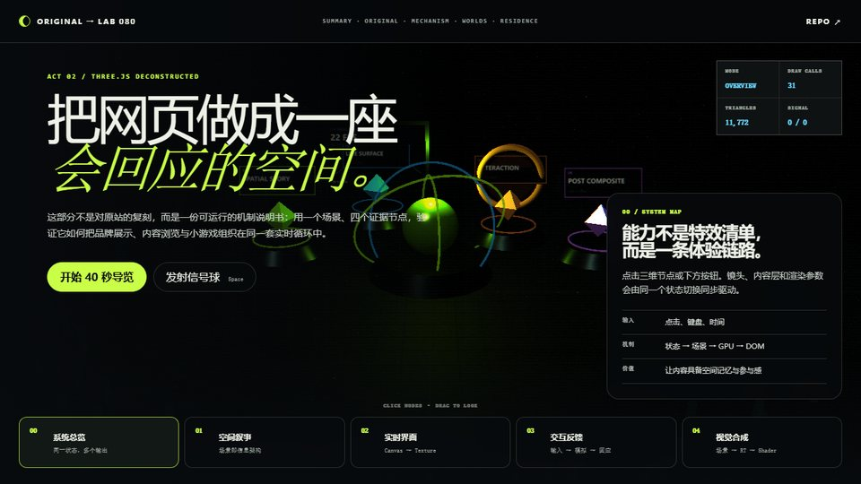
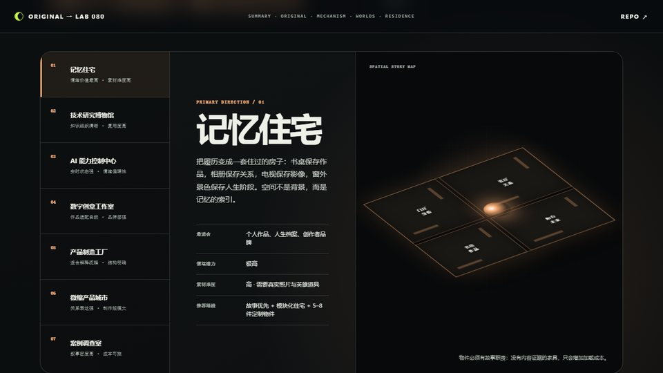
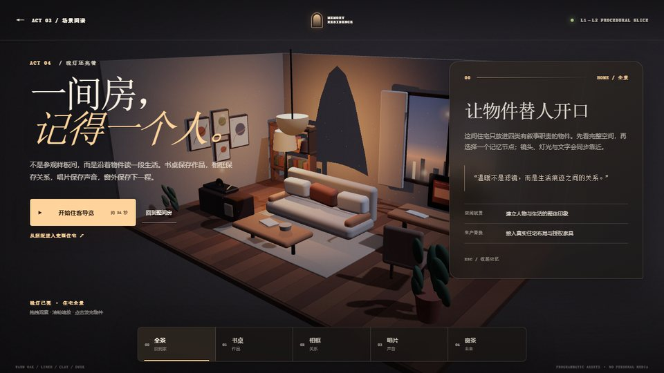
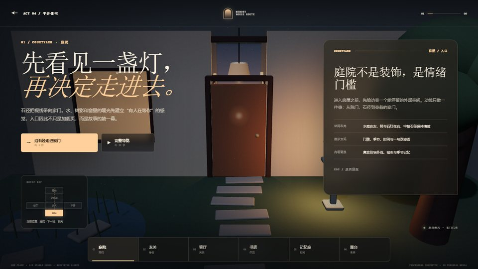

# Sublevel Studio：把作品集组织成可玩的空间

> 它不是一个可安装的“组件库”，而是一份高密度的 Three.js 单页作品集概念：空间叙事、小游戏、DOM 内容、实时纹理和 Shader 后期被编排进同一体验。建议先看原作效果，再阅读拆解和我们的扩展样例。

## 快速回顾

### 01 · 上游原作

[](https://mengto.github.io/sublevel-studio/)

*上图由 [Sublevel Studio 上游仓库](https://github.com/MengTo/sublevel-studio)直接提供，点击进入官方在线体验；本仓库没有复制或再分发该图片。上游未附开源许可证。*

### 我们的四个演示样例

点击图片进入 GitHub Pages 在线演示。

| 02 · 机制实验台 | 03 · 七种扩展世界 |
| --- | --- |
| [](https://yydshly.github.io/0904_codex_project/projects/080-sublevel-studio/demo/#lab) | [](https://yydshly.github.io/0904_codex_project/projects/080-sublevel-studio/demo/#extensions) |
| 空间状态、实时纹理、交互反馈与 Shader 后期。 | 比较七种空间方向、素材难度与推荐切入点。 |
| 04 · 半开记忆住宅 | 05 · 庭院入户住宅 |
| [](https://yydshly.github.io/0904_codex_project/projects/080-sublevel-studio/demo/residence/) | [](https://yydshly.github.io/0904_codex_project/projects/080-sublevel-studio/demo/residence/journey/) |
| 一间客厅书房、四个记忆节点和约 24 秒导览。 | 庭院、玄关、客厅、书房、记忆廊、露台完整路线。 |

**推荐阅读路线：** [研究总览](https://yydshly.github.io/0904_codex_project/projects/080-sublevel-studio/demo/) → [半开住宅](https://yydshly.github.io/0904_codex_project/projects/080-sublevel-studio/demo/residence/) → [庭院多房间住宅](https://yydshly.github.io/0904_codex_project/projects/080-sublevel-studio/demo/residence/journey/)。

## 我们的库现在是什么

这是一个“研究证据 + 可运行机制 + 场景模板”的子项目，不是对上游源码的再发行，也不是已经封装完成的 npm SDK。

| 层级 | 我们提供的产物 | 可以复用什么 |
| --- | --- | --- |
| 原作证据 | 上游在线页与本地研究快照的选择器 | 先验证真实能力，再讨论迁移方向 |
| 机制实验 | 独立 Three.js 能力实验台 | 状态驱动相机、CanvasTexture、交互反馈、后期合成 |
| 方向研究 | 七种扩展场景和记忆住宅深入分析 | 内容到空间的映射、资产阶梯和实施路线 |
| 住宅模板 | 半开房间与庭院多房间两条原创路线 | 房间图、镜头导演、可见灯光登记、DOM/WebGL 同步 |
| 交付基础 | 深链接、键盘、减少动态、无 WebGL 回退和 Pages 构建 | 把沉浸式原型转成可分享、可检查的网页 |

## 项目信息

- 原仓库：<https://github.com/MengTo/sublevel-studio>
- 上游在线演示：<https://mengto.github.io/sublevel-studio/>
- 在线研究总览：<https://yydshly.github.io/0904_codex_project/projects/080-sublevel-studio/demo/>
- 原作优先演示与能力实验台：[打开 Demo](demo/)
- 温馨记忆住宅垂直切片：[进入住宅](demo/residence/)
- 庭院入户与多房间路线：[从庭院进门](demo/residence/journey/)
- 研究状态：已完成源码审阅、五幕能力拆解，以及庭院—入户—多房间住宅原型
- 主要技术：Three.js、WebGL、GLSL、Canvas 2D、原生 DOM/CSS、GLTFLoader
- 研究版本：`355a1581d9812065d808ec32ea82f956e8da805b`
- 最后更新：2026-09-05

## 先说结论

Sublevel Studio 的核心能力，是把“内容网站”改造成一套持续运行的实时体验系统：3D 大厅负责建立世界观与空间记忆，射线检测和状态机负责切换体验，CanvasTexture 把游戏/数据界面送进 3D 屏幕，DOM 继续承担长文本和可访问内容，最后再用 Shader 把画面统一成具有品牌感的影像。

它展示的是一种产品与创意工程的组合能力，不是开箱即用的 SDK。真正值得复用的是架构模式和叙事方法，而不是页面源码本身。

## 演示阅读顺序

Demo 采用“原作证据优先”的五幕结构：

1. **第一幕先展示上游原作。** 页面内直接运行 Sublevel Studio；本地研究环境优先载入 `source/` 中的 commit 快照，静态发布环境则载入官方在线页。访客可以先探索京都大厅、街机、篮球、CRT、3D 菜单与下方作品集。
2. **第二幕再解释机制。** 看过真实效果后，进入不含上游素材和代码的独立能力实验台，逐项验证空间导航、CanvasTexture、交互反馈和 Shader 后期。
3. **第三幕比较扩展世界。** 用交互式场景图谱比较七个可落地方向，并重点拆解记忆住宅的空间脚本、资产阶梯、运行架构和交付路线。
4. **第四幕进入记忆住宅。** 在独立路由中运行一间温馨客厅书房：点击书桌、相框、唱片和窗景，观察镜头、光线、URL 与 DOM 记忆层如何由同一状态同步。
5. **第五幕从庭院真正进门。** 保留第四幕的半开住宅，另开一条 `庭院 → 玄关 → 客厅 → 书房 → 记忆廊 → 露台` 路线；点发光家门、房间轨道或完整导览都由同一房间图驱动。

这样可以把“它实际做到了什么”与“我们可以迁移什么”分开，避免用抽象原型代替原作证据。

## 它具备什么能力

| 能力层 | 上游证据 | 产生的体验 |
| --- | --- | --- |
| 空间主页 | Three.js 大厅、程序化建筑/地形、嵌入式 GLB 人物与动物 | 第一屏成为可探索的品牌世界，而非静态 Hero |
| 多模式交互 | Raycaster、键鼠输入、`home / arcade / hoop / tv` 等模式状态 | 一个页面内可以进入不同交互“房间”并安全返回 |
| 可玩内容 | CanvasTexture 街机射击、篮球投掷与计分 | 访客不只浏览，也通过规则和反馈参与 |
| 内容展示 | CRT 作品屏、滚动 DOM 作品集、机器可读视图 | 视觉叙事与真正可读的项目信息并存 |
| 实时图形 | 程序化 Canvas 纹理/法线、粒子、地形、灯光与手工阴影 | 不依赖大量外部贴图也能构建有风格的场景 |
| 后期合成 | RenderTarget + VHS/CRT 风格全屏 Shader | 为所有 3D 内容施加一致的影像语言 |
| 响应与性能 | DPR 上限与动态降级、错峰屏幕更新、滚动暂停、IntersectionObserver | 让多个实时模块在浏览器中相对克制地运行 |

## 底层原理

```text
用户输入 / 页面滚动 / 时间
          ↓
     JavaScript 状态机
      ↙      ↓       ↘
相机与物体  Canvas 纹理  DOM 内容层
      ↘      ↓       ↙
       Three.js 场景抽象
              ↓
 WebGL：顶点、材质、纹理、绘制调用
              ↓
  离屏 RenderTarget → 全屏 GLSL 后期
              ↓
          浏览器像素
```

Three.js 负责场景、相机、网格、材质、纹理与加载器等高层对象；WebGL 负责把顶点和像素任务提交给 GPU；Shader 则决定几何如何变换、最终像素如何被着色。JavaScript/CPU 仍然负责输入、状态切换、游戏规则、DOM 更新和每帧调度。

上游一个很有代表性的技巧是 `CanvasTexture`：先在普通 2D Canvas 上画游戏、文字或程序化图案，再把这张画布作为 GPU 纹理贴到 3D 屏幕或材质上。这样传统网页/小游戏逻辑与三维世界之间就有了低门槛接口。

另一个关键是“导演状态”。多个模式并非互不相干的页面，而由同一个运行时协调：选中对象后改变相机目标、激活输入规则、更新屏幕内容，并控制如何回到主页。最终画面还能先渲染进离屏纹理，再由全屏 Shader 叠加扫描线、色差、噪声等风格。

## 本地能力实验台

Demo 的第一幕展示上游真实运行效果；第二幕提交了一个不使用上游美术、模型和页面代码的独立演示，集中验证四个可迁移模式：

1. **空间叙事**：四个能力站点同时是场景地标和信息导航，Raycaster 与文字按钮共享同一选择状态。
2. **实时表面**：动态监控屏由 Canvas 2D 绘制，并作为 `THREE.CanvasTexture` 定期更新。
3. **交互反馈**：点击“发射信号球”或按空格触发轻量弹道、重力、命中检测、轨迹和计分。
4. **后期合成**：主场景先进入 `WebGLRenderTarget`，再由全屏 GLSL 完成色差、扫描线、噪声和暗角。

“开始 40 秒导览”会按 `总览 → 空间 → 实时表面 → 交互 → 后期 → 总览` 推进；自由模式下可以点击三维站点、拖拽观察，或使用底部的可访问按钮。

## 扩展场景图谱

| 场景 | 主要价值 | 素材难度 | 推荐切入点 |
| --- | --- | --- | --- |
| 记忆住宅 | 情绪价值最高，个人经历天然映射为空间 | 高 | 一间书房、一个真实项目、一件英雄物件 |
| 技术研究博物馆 | 知识组织清晰，组件复用度高 | 中 | 一个展厅和三个证据展台 |
| AI 能力控制中心 | 擅长表达实时系统状态 | 中 | 一条真实工作流和四个状态设备 |
| 数字创意工作室 | 作品媒介与空间物件映射自然 | 中高 | 工作台、草图墙和放映机 |
| 产品制造工厂 | 擅长解释业务与产品流程 | 中 | 一条准确的装配/验证链路 |
| 微缩产品城市 | 擅长表达多产品生态关系 | 高 | 先完成一个可运行街区 |
| 案例调查室 | 低至中等资产成本也能形成高叙事密度 | 中 | 一个案例的线索、取舍和结果 |

### 首选方向：记忆住宅

记忆住宅的优势不是“住宅模型好看”，而是每个常见空间都自带情绪语义：门厅建立身份，客厅呈现关系，书房证明作品，走廊组织时间，阳台表达未来。它可以把普通履历转换成一条有进入、发现、回望和离开的空间叙事。

它也是七个方向里最依赖素材质量的路线。当前真实个人素材状态仍是 **L0**，但已经以程序化几何、材质和 Canvas 纹理完成 **L1–L2 叙事切片**。它可以验证构图、光线、镜头和内容模型，不能替代真实照片、声音与近景英雄资产。建议继续采用四级资产阶梯：

1. **L1 叙事灰盒**：基础几何、镜头和灯光，只验证空间与节奏。
2. **L2 模块化住宅**：可授权的墙体、门窗和基础家具，统一比例、UV 与 PBR 材质。
3. **L3 英雄物件**：定制 5–8 件近景物品，并接入真实照片、视频、声音和作品内容。
4. **L4 真实空间捕捉**：只有在确有原型住宅时才采用摄影测量或 3DGS，作为高成本可选层。

运行架构应保持数据驱动：`内容模型 → 房间图 → 资产注册表 → 导演状态 → WebGL / DOM`。WebGL 负责空间、光影和情绪，DOM 负责长文本、项目证据、链接、深链接和无障碍；房间分区懒加载，并为移动端、弱 GPU 和减少动态提供替代路线。

最小可行切片不是整套住宅，而是“一间可信的书房”：一个真实项目在电脑或样机上出现，一件英雄物件承载个人记忆，镜头、声音和 DOM 案例页形成完整闭环。这个切片通过资产、性能和叙事验证后，再扩展客厅、走廊与阳台。

### 已实现：温馨住宅垂直切片

新路由 `demo/residence/` 把分析推进成可运行场景：浅橡木地板、米白织物、陶土、植物与蓝紫暮色构成室内暖 / 室外冷的主关系；落地灯和吊灯形成不同高度的暖光池，避免均匀顶光把房间照成样板间。所有家具、画面和屏幕内容均为独立程序化原型，没有使用上游素材，也没有虚构个人照片。

- **书桌 / 作品**：电脑屏幕作为真实案例的未来内容槽，点击后镜头进入工作区。
- **相框 / 关系**：四幅抽象占位图验证照片墙的空间尺度，生产阶段应替换为经授权的真实记忆。
- **唱片 / 声音**：验证声音节点、唱片旋转和主动播放的交互位置；当前原型保持静音。
- **窗景 / 未来**：用暮色城市作为旅程出口，为后续行动保留唯一的远景节点。
- **住客导览**：约 24 秒自动经过全景与四个节点；任何拖拽或再次点击都能恢复自由探索。

键鼠、触控、键盘导航、Escape 回家、减少动态和显式 `?webgl=off` 回退均属于同一静态页面。生产升级时，应首先把电脑项目、照片、音频和一件近景物件替换为真实内容，再考虑扩房与更重的效果。

### 已实现：庭院入户与多房间路线

新路由 `demo/residence/journey/` 不替换上面的半开样例，而是验证一条更完整的空间叙事。第一屏在暮色庭院用石径、水景、树影和亮门建立期待；点击页面主操作或三维门后，门扇打开、镜头沿路径进入玄关，再允许直接选房或播放约 30 秒的完整导览。

六个稳定空间都位于同一水平基准面，并承担不同内容职责：庭院建立期待，玄关用身份陈列回答“谁住在这里”，客厅用围合布局和照片墙讲关系，书房用项目屏与工作台展示作品，线性记忆廊组织时间，露台以开阔远景结束并承接未来行动。每站具有独立机位、局部发光物、布局和 DOM 说明，URL hash 可直接定位；底部路线与桌面平面图让访客随时知道当前位置和下一站。

实现采用数据驱动的 `ZONES` 房间图和 `LIGHT_SPECS` 灯光登记表。所有局部光都绑定可见灯具，房间切换统一更新相机、门、灯光、地标、文字面板和 URL。当前仍是程序化 L1–L2 原型：它证明路线、构图和媒介分工，不代表已经具备真实住宅模型或个人素材。后续可把照片、项目、声音和英雄物件作为内容层替换，而无需重写导航结构。

### 视觉与资产依据

本轮没有复制任何参考室内图，只把检索结果归纳成可执行的视觉约束。温暖 Japandi 住宅常用浅橡木、米白织物、陶土与低矮家具，并以多个低位、不同高度的暖光源代替单一强顶灯；这些规律被转译为当前场景的材质、尺度与三处光区。渲染端采用 Three.js 官方文档覆盖的色彩空间、ACES tone mapping 和软阴影路径。后续如需真实 HDRI、PBR 纹理或家具模型，可优先从明确采用 CC0 的 Poly Haven 建立授权资产登记，而不是直接抓取来源不明的模型。

- [温暖 Japandi 客厅的材质与分层灯光参考](https://calmandoak.com/journal/japandi-living-room/)
- [Three.js WebGLRenderer：色彩空间、tone mapping 与阴影](https://threejs.org/docs/pages/WebGLRenderer.html)
- [Poly Haven CC0 资产许可](https://polyhaven.com/license)

## 如何获取与运行

上游源码已获取到本地忽略目录 `projects/080-sublevel-studio/source/`，版本和许可边界见 [UPSTREAM.md](UPSTREAM.md)。若该目录不存在，可在研究库根目录重新执行：

```powershell
git clone --depth 1 https://github.com/MengTo/sublevel-studio.git projects/080-sublevel-studio/source
```

启动一个静态服务器：

```powershell
python -m http.server 4173
```

然后访问：

- 原始上游本地页：<http://127.0.0.1:4173/projects/080-sublevel-studio/source/>
- 独立能力实验台：<http://127.0.0.1:4173/projects/080-sublevel-studio/demo/>
- 温馨记忆住宅：<http://127.0.0.1:4173/projects/080-sublevel-studio/demo/residence/>
- 庭院入户与多房间路线：<http://127.0.0.1:4173/projects/080-sublevel-studio/demo/residence/journey/>

不要用 `file://` 直接打开；ES Module、字体或其他资源受浏览器源策略影响，静态服务器更接近真实部署环境。

## 适用场景

- 创意工作室、设计师、开发者的沉浸式作品集。
- 产品发布页、品牌活动页、展览官网和数字艺术项目。
- 需要“玩一下就理解”的技术能力演示或研究档案。
- 小型浏览器游戏与叙事网站的混合形态。
- 把实时数据、视频或 2D 小游戏嵌进 3D 空间的展示系统。

它不适合以 SEO、可访问性、首屏速度或高频业务操作为第一优先级的常规后台、资讯站和交易流程；这些场景应让 DOM 主导，3D 只作为可渐进增强的局部层。

## 可扩展方向

### 从作品变成框架

- 把单文件拆为 `world / modes / interactions / ui / postfx` 模块。
- 使用统一有限状态机声明模式的进入、暂停、退出与输入所有权。
- 将站点和作品改为 JSON/MDX/CMS 数据驱动，而不是硬编码在场景脚本中。
- 提供事件总线，让 DOM、CanvasTexture、小程序与 3D 节点通过稳定协议协作。

### 从演示变成产品

- 按路由懒加载小游戏、模型和 Shader，先展示可读 DOM 外壳。
- 建立 GPU/弱网预算，自动切换 DPR、阴影、粒子量、纹理刷新频率与无 WebGL 回退。
- 补齐触摸手势、键盘焦点、`prefers-reduced-motion`、旁白与语义化替代内容。
- 加入深链接和会话恢复，使每个作品或空间节点可直接分享。
- 将“导览模式”扩展为可录制时间线，输出封面、短视频、字幕与讲解。

### 从手工创作变成生成系统

- 用关卡描述文件生成空间地标、相机机位和导航关系。
- 用设计令牌统一 DOM、3D 材质、灯光和 Shader 的品牌参数。
- 给 AI 或编辑器提供受约束的场景工具，而不是让模型直接修改一个超大 HTML 文件。
- 把 CanvasTexture 节点抽象为小应用容器，承载实时数据、远程协作或多媒体内容。

## 对我们的意义

1. **研究成果要能被体验。** 研究页可以不止是长文；最关键的机制应该有一个可点击、可观察、可比较的最小证明。
2. **DOM 与 WebGL 是协作关系。** 3D 提供空间记忆、情绪和参与感，DOM 保证内容密度、可访问性与可索引性。两者由同一状态同步，比“全都塞进 Canvas”更稳健。
3. **小游戏是解释器。** 投掷、驾驶或射击不是为了炫技；当交互规则映射到产品能力时，它能更快说明“系统如何响应”。
4. **Film Mode 值得标准化。** 自由探索对体验好，但不利于汇报与传播。自动导览让同一原型同时服务演示、录屏和决策沟通。
5. **先复用模式，不复用源码。** 上游没有开源许可证，而且实现高度耦合在单个 HTML 中。我们的最佳路径是抽取经过验证的机制，形成独立、模块化、可测试的内部模板。

## 局限与边界

- 上游没有提供开源许可证；本地获取只用于阅读和运行验证，不代表获得复制、修改或再分发授权。
- 上游实现集中在约 4.35 MB、5,245 行的单个 `index.html`，便于发布单页概念，但不利于模块维护、测试和团队协作。
- 同页存在多套渲染模块和多个动画循环，且主大厅与玻璃菜单使用了不同 Three.js 版本，长期维护有依赖漂移风险。
- 桌面端交互较完整，但部分小游戏主要依赖键盘，移动端需要额外触控设计。
- 部分“机器可读路由”是体验内的模拟视图，并非真正的服务端 API、CMS 或独立文本端点。
- 本地能力实验台是机制证明：依赖 CDN 载入 Three.js，未包含构建拆包、离线缓存、模型资产与完整自动化测试，不能直接等同于生产站点。

## 本地运行与验证

实际验证结果：

- `node --check`、目录索引检查与 Pages 静态构建全部通过。
- 演示首屏会先探测并运行本地上游快照 `355a1581`；已确认 iframe 的实际文档地址与来源标签一致，并可切换到官方在线版。
- 原作大厅、作品集 DOM、3D 投影菜单和机器视图入口均在嵌入页中可见；3D 菜单已完成展开/收起交互验证。
- 第二幕 WebGL 实验台在首屏保持暂停，进入 `#lab` 后才开始渲染，避免与上游原作同时占用两个实时循环。
- 桌面首屏 Canvas 非空；实测为 31 个 draw calls、11,772 个三角形，控制台无 error/warning。
- 空间、实时纹理、信号球和高强度后期四种状态均可通过文字按钮切换。
- 信号球分别由按钮和键盘触发，两次均命中，计分从 `0 / 0` 更新到 `2 / 2`。
- 自动导览启动后在 6.4 秒推进到空间节点，暂停后保持当前状态。
- 390×844 竖屏与 844×390 横屏均完成视觉检查；横屏首轮发现的控件重叠已修复。
- `?motion=reduce&node=postfx` 确认可直接进入减少动态的后期节点，系统将暂停装饰旋转并限制后期强度。
- 庭院路线在 1280×800、760×900、390×844 三个视口均保持单屏且无文档横向溢出，Canvas 与视口等大，控制台无应用错误。
- 三维家门与页面入户按钮都会触发 `courtyard → entering → foyer`；玄关、客厅、书房、记忆廊、露台的独立状态、hash、相机和内容面板均已验证。
- 庭院路线的完整导览、手动暂停、Escape 回庭院、可见键盘焦点、减少动态即时入户，以及 `?webgl=off` 六站文字回退均通过。

## 图片说明

图片的来源、许可与详细文字说明统一记录在 [images/README.md](images/README.md)。

## 参考资料

- [Sublevel Studio 仓库](https://github.com/MengTo/sublevel-studio)
- [Sublevel Studio 在线页](https://mengto.github.io/sublevel-studio/)
- [Three.js 文档](https://threejs.org/docs/)
- [WebGL 基础规范入口](https://www.khronos.org/webgl/)
