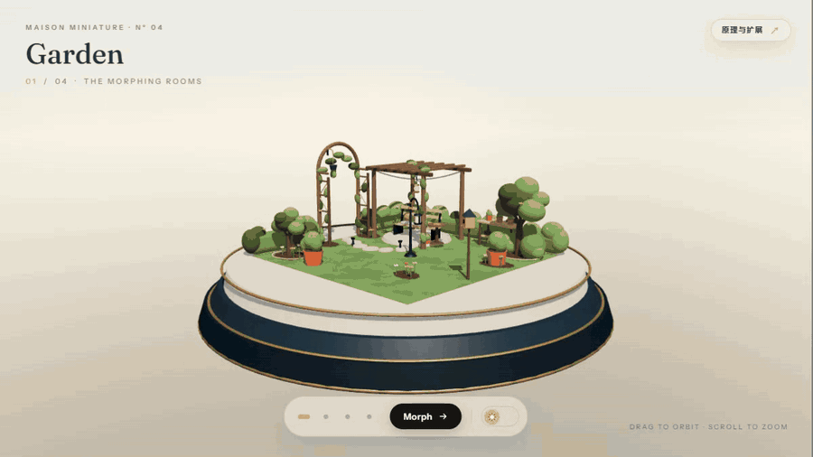
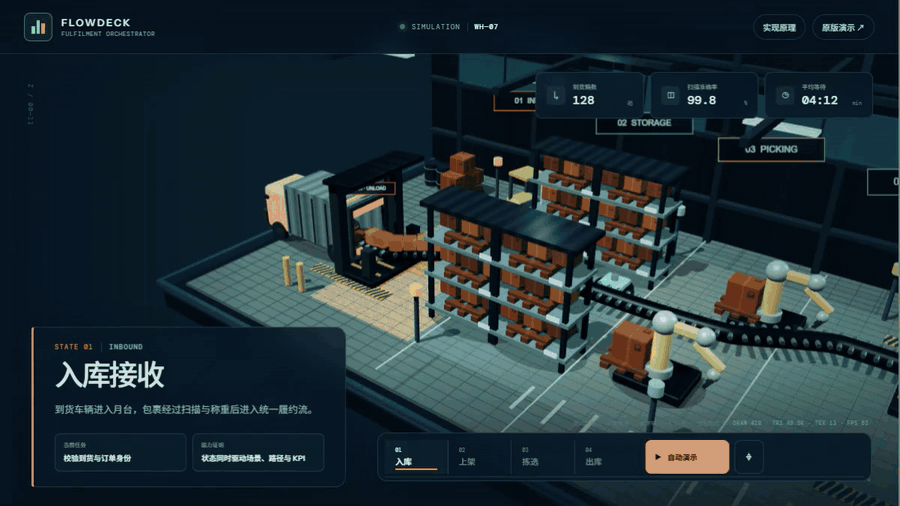

# Home Sweet Home：四态空间 Morph 展示

> 一个纯前端 Three.js 微缩空间：花园、客厅、餐厅和卧室在同一舞台上连续换景，并同步改变材质、灯光与氛围。

## 先看两个演示

### 1. 原库能力：四态空间 Morph

[](https://yydshly.github.io/0904_codex_project/projects/090-home-sweet-home/demo/)

同一座舞台依次变成花园、客厅、餐厅和卧室，最后切入夜景。重点观察：对象并非整体替换场景，而是以 Actor 为单位切换形态、移动落位，并与材质权重、灯光和曝光同步过渡。[打开在线演示](https://yydshly.github.io/0904_codex_project/projects/090-home-sweet-home/demo/) · [查看高清 MP4](images/demos/garden-demo.mp4)

### 2. 衍生验证：智能仓储履约编排

[](https://yydshly.github.io/0904_codex_project/projects/090-home-sweet-home/demo/warehouse.html)

入库、上架、拣选和出库共用同一座仓储沙盘；每次状态变化会同时改变镜头、区域、货流、设备、KPI 和说明。入库从货厢后门卸货，出库从货厢后门装车。[打开在线演示](https://yydshly.github.io/0904_codex_project/projects/090-home-sweet-home/demo/warehouse.html) · [查看高清 MP4](images/demos/warehouse-demo.mp4)

> GIF 用于快速理解，不替代可交互页面。录制源文件、字幕、封面、压缩参数与重新生成方法见 [演示媒体包](images/demos/README.md)。

## 我们的核心理解

`home-sweet-home` 表面上是一组程序生成的低模 3D 效果，真正值得复用的却不是某件家具或某个房间，而是一个**状态驱动的空间叙事编排模式**：

```text
离散业务/叙事状态
  → Actor 的语义形态与 Transform
  → 全局材质、灯光与 Shader 权重
  → 镜头、DOM 文案和交互反馈
  → 每帧统一提交到 WebGL
```

它确实会“用程序生成多个 3D 形态并组合起来”，但不是简单把几个独立效果首尾拼接。四个空间共享舞台、语义对象和渲染循环；切换时，CPU 侧状态系统统一调度对象级换形和变换，GPU 侧 Shader 完成连续材质与像素效果，因此观众感受到的是同一个世界发生变化。

## 项目信息

- 原仓库：<https://github.com/iamtechartist/home-sweet-home>
- 上游版本：`9b69f10bf12bf93022ddd96ba806a7aaf3185f7c`
- 在线原版演示：[打开 Garden / Living / Dining / Bedroom Demo](https://yydshly.github.io/0904_codex_project/projects/090-home-sweet-home/demo/)
- 在线原理导览：[打开“如何实现与如何扩展”](https://yydshly.github.io/0904_codex_project/projects/090-home-sweet-home/demo/guide.html)
- 在线衍生能力：[打开“智能仓储履约编排”](https://yydshly.github.io/0904_codex_project/projects/090-home-sweet-home/demo/warehouse.html)
- 上游演示：<https://iamtechartist.github.io/home-sweet-home/>
- 研究状态：已完成首轮能力验证
- 主要技术：Three.js 0.185、WebGL、GLSL、原生 HTML/CSS/JavaScript
- 获取日期：2026-09-05

## 首先看它能展示什么

1. **四空间连续换景**：Garden、Living Room、Dining Room、Bedroom 共用一座微缩舞台，通过对象级编排完成空间用途变化。
2. **程序化低模资产**：家具、植物、墙面、地毯和灯具主要由基础几何体组合生成，不依赖外部 GLB/GLTF 模型。
3. **昼夜氛围切换**：天空、星点、环境光、主光、曝光、灯具辉光和萤火虫会随模式连续变化。
4. **材质与 Shader 动态**：代码生成木纹与织物微纹理，并通过 Shader 实现植物摆动、地面材质混合、地毯图案、灯串和粒子。
5. **空间浏览交互**：支持拖动环绕、滚轮缩放、场景点选、Morph 按钮以及 `M` / `L` 键盘快捷操作。
6. **零构建静态交付**：原作由一个 `index.html` 承载，可直接由静态服务器或 GitHub Pages 发布。

## 然后理解它如何实现

[交互式原理与扩展导览](https://yydshly.github.io/0904_codex_project/projects/090-home-sweet-home/demo/guide.html)把原版演示固定在观察窗中，同时把源码拆成一条可操作的数据流：

- **六层架构检查器**：渲染底座 → 程序资产 → Actor 状态 → 转场导演 → 全局氛围 → 逐帧提交。
- **Actor 四态检查器**：查看同一语义角色在 Garden、Living、Dining、Bedroom 中如何切换 form 与 transform。
- **Morph 时间轴**：拖动进度，观察错峰等待、旧形态收缩、对象移动、新形态弹出和落位。
- **CPU / GPU 分工**：JavaScript 维护状态并更新 uniform，GLSL 并行完成顶点和像素效果。
- **扩展路线选择器**：针对品牌叙事、空间配置器、真实资产、可复用引擎和真正顶点 Morph 给出不同的最短验证路线。

为了保留可核对的上游基线，未修改版本存放在 `demo/upstream-index.html`；`demo/index.html` 只增加了原理导览入口。

## 衍生能力：智能仓储履约编排

[智能仓储能力演示](https://yydshly.github.io/0904_codex_project/projects/090-home-sweet-home/demo/warehouse.html)把原库的状态编排模式应用到业务场景：入库、上架、拣选和出库共用同一座仓储沙盘。每次状态变化会同步更新镜头焦点、活动区域、货物流线、设备 Actor、模拟 KPI 与操作说明。

这证明可复用的核心不是“房间效果”，而是**一个状态驱动多个视觉与信息表面**。当前页面是零后端模拟原型，不代表已连接 WMS、传感器或真实调度算法。

仓储素材采用 L2–L3 混合程序化路线：车辆、叉车、AMR、机械臂、货架和建筑外壳由可复用 Three.js 零件构建，混凝土、纸箱、金属与警示条纹理由 CanvasTexture 生成。来源、预算和正式资产升级边界见 [demo/ASSETS.md](demo/ASSETS.md)。

## 能力地图

| 维度 | 已实现 | 当前边界 |
| --- | --- | --- |
| 渲染 | WebGLRenderer、ACES Filmic、PCF 阴影、响应式镜头适配 | 无后处理和画质档位 |
| 场景资产 | 程序化家具、植被、墙体、地毯、灯具、粒子 | 无真实产品模型和资产加载器 |
| 动画 | 对象位移、旋转、缩放、弹性出现、错峰换景 | 不是顶点 Morph Target |
| 光照 | 昼夜插值、局部点光、Emissive、星光和萤火虫 | 没有环境贴图或物理时间系统 |
| 交互 | 四态导航、环绕、缩放、键盘快捷键 | 无物体选择、拖放、编辑或碰撞 |
| 发布 | 单文件静态站、MIT 许可 | 依赖 jsDelivr 和 Google Fonts 网络资源 |

## 适合与不适合的使用场景

适合：

- 品牌故事、产品功能章节、空间主题切换和活动专题页；
- 展厅、园区、仓储、流程沙盘等“同一空间、多种状态”的业务说明；
- 需要视觉记忆点，但不要求真实工程精度的概念验证；
- 将少量离散状态讲成连续故事的 WebGL 互动页面。

不适合直接承担：

- 精确户型设计、工程测量、碰撞仿真或真实数字孪生；
- 大规模自由编辑器、海量资产管理或真实 WMS 调度；
- 依赖照片级近景的商品展示——当前程序化资产只能达到原型到中景展示质量。

## 可扩展方向

| 方向 | 最小改造 | 什么时候值得做 |
| --- | --- | --- |
| 数据驱动场景 | 把 Actor、状态、镜头和文案抽成配置 | 需要频繁新增主题或业务流程 |
| 真实资产 | 接入 GLB/glTF、KTX2、Draco/Meshopt 与 LOD | 需要品牌产品、设备近景或正式发布 |
| 空间配置器 | 增加拾取、拖放、吸附、碰撞、保存与分享 | 用户需要编辑空间，而非观看换景 |
| 业务编排 | 接入状态机、事件时间线、异常分支和数据适配器 | 需要从演示升级为可解释运营界面 |
| 渲染深化 | 后处理、环境贴图、质量档位与自适应 DPR | 视觉规格提高且移动端预算允许 |
| 性能工程 | Geometry/Material 复用、InstancedMesh、资源释放 | Actor 与状态规模持续增加 |

## 对我们的意义

这次验证得到的可迁移结论是：**把“状态”定义成唯一事实源，再让 3D、镜头、动效、指标和说明成为它的多个投影。**

因此它可以成为一类业务可视化原型的轻量骨架，而不仅是家居展示：先用程序化资产快速验证信息结构和交互叙事，再根据商业价值决定是否接入真实模型、真实数据和生产级资源管线。仓储衍生演示证明，同一思路能够脱离房间题材，迁移到具有流程、设备和 KPI 的业务场景。

## 关键设计

源码把每个可变对象定义为一个 Actor：

```text
Actor
├─ forms[4]   四个空间中的外形
├─ states[4]  每个空间中的位置、旋转、缩放
└─ timing     延迟、上浮距离、换形时机
```

切换时旧形态先缩小，Actor 沿缓动轨迹移动和旋转，新形态再弹性出现。地板、地毯、墙色和光照不使用离散切换，而是通过四个场景权重连续插值。因此视觉上像“房间发生形变”，底层实质是**语义对象换形 + 舞台调度 + 全局材质过渡**。

## 本地运行

在仓库根目录执行：

```powershell
python -m http.server 4190 --directory projects/090-home-sweet-home/demo
```

然后打开 <http://127.0.0.1:4190/>。不要直接双击 HTML；ES Module 和远程模块加载在 HTTP 环境下更可靠。

## 本地验证清单

- 页面能加载 Garden 首屏，微缩场景、阴影和 UI 正常显示。
- 四个场景按钮均能触发换景，标题和序号同步更新。
- Morph 按钮能够顺序循环四个场景。
- 日夜开关能够改变天空、灯光和发光效果。
- 鼠标拖动可环绕，滚轮可在限制范围内缩放。
- 浏览器控制台无运行时错误。

## 可复用的启发

- 用统一的 Actor 语义槽位表达“同一角色在不同场景中的形态”，比维护四套互不相关的场景更适合做转场。
- 将物体变换、材质权重和光照权重纳入同一帧循环，可以让换景拥有一致的视觉节奏。
- 程序化低模适合品牌微站、概念演示和互动叙事；需要真实商品表现时，再接入 GLTF/KTX2 资产管线。

## 局限与下一步

当前所有场景形态都会预先创建并通过缩放隐藏，重复植物也没有使用 InstancedMesh。项目规模增大后，应优先拆分模块、复用 Geometry、实例化重复对象，并增加资源生命周期、移动端画质档位和 WebGL 降级方案。

下一阶段可以在保留原作的前提下增加“能力导览模式”：自动依次展示四空间换景、昼夜变化、植物摆动和局部灯光，并用 DOM 字幕解释每一步证明了什么。

## 图片说明

封面来源、许可和文字描述见 [images/README.md](images/README.md)。

## 参考资料

- [项目 README](https://github.com/iamtechartist/home-sweet-home)
- [固定版本源码](https://github.com/iamtechartist/home-sweet-home/tree/9b69f10bf12bf93022ddd96ba806a7aaf3185f7c)
- [Three.js 文档](https://threejs.org/docs/)
