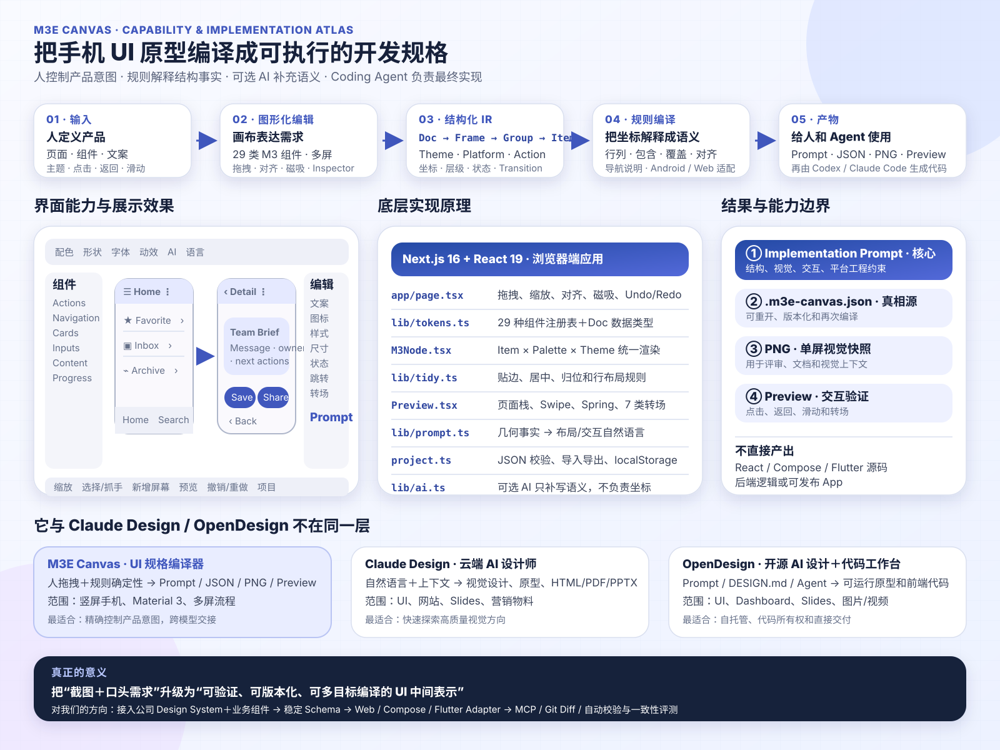

# M3E Canvas：把可视化草图编译成 AI 编程提示词

> 一个面向 Material 3 Expressive 的浏览器原型工具：用受约束的组件搭建多屏流程，再把主题、布局和交互编译成可交给 Codex、Claude Code、Cursor 等工具的实现说明。



## 项目信息

- 原仓库：<https://github.com/lnkiai/m3e-canvas>
- 在线演示：<https://lnkiai.github.io/m3e-canvas/>
- 本地源码：`source/m3e-canvas`（按仓库约定不纳入外层 Git）
- 验证版本：`de5eb2025e5eb7ac6cb8e4746eb519887057f066`
- 研究状态：已完成本地运行与真实交互验证
- 主要技术：Next.js 16、React 19、TypeScript、Motion、html-to-image
- 最后更新：2026-09-05

## 为什么关注

M3E Canvas 的价值不只是“又一个轻量画布”。它把设计意图保存为 `Doc → Frame → Group → Item` 的结构化中间表示，再用确定性规则推导屏幕结构、组件关系和导航行为，最后生成自然语言实现规格。

这提供了一条比纯截图识别更可靠的设计到代码路径：用户负责可视化表达，规则引擎负责结构事实，AI 编程工具负责工程实现；可选 LLM 只补写组件行为和屏幕说明，不参与坐标计算。

## 已验证的能力演示

本次在真实浏览器中完成了以下操作，而不是只阅读 README：

| 能力 | 演示动作 | 验证结果 |
| --- | --- | --- |
| 多屏画布 | 在默认 Home 之外新增“详情”屏幕 | 画布同时维护两个独立手机 Frame |
| M3E 主题 | 切换 Blue 配色、全圆 Shape、Expressive Motion | 组件外观即时变化，提示词同步写入对应主题规则 |
| 组件搭建 | 拖入 Top App Bar、Card、两个 Button | 组件可选中并编辑标题、正文、图标和样式 |
| 磁吸组合 | 把两个 Button 靠近放置 | 自动形成 Connected button group，内侧圆角收紧 |
| 交互连线 | Home 导航栏的搜索项连接到详情屏；详情 App Bar 前置按钮配置返回；Save 连接 Home | 画布出现流程连线，生成的行为说明包含目标屏幕和过渡类型 |
| 可点击预览 | 从 Home 点击底部搜索项进入详情，再执行返回 | 预览真实切屏，返回时恢复 Home |
| Prompt 编译 | 在 Android 与 Web 目标间切换 | 同一设计生成不同平台、持久化和标准组件建议 |
| 项目导出 | 从项目菜单保存 JSON | 得到可重新导入的 2 屏、8 组组件演示工程 |

可直接导入的演示文件：[`examples/message-flow.m3e-canvas.json`](examples/message-flow.m3e-canvas.json)。

## 演示项目包含什么

`message-flow.m3e-canvas.json` 保存了本次浏览器实操结果：

- 两个屏幕：`Home` 和 `详情`。
- Blue 浅色配色、全圆组件形状和 Expressive 弹簧动效。
- Home 的 App Bar、Connected button group、三项列表、FAB 和底部导航栏。
- 详情页的 App Bar、内容卡片以及 `Save / Share` 磁吸按钮组。
- Home 搜索导航项 → 详情页的右侧滑入过渡。
- 详情页 App Bar 返回，以及 Save → Home 的淡入过渡。
- Web 为当前输出目标；可在提示词面板一键切回 Android。

## 本地运行

```powershell
cd projects/100-m3e-canvas/source/m3e-canvas
npm ci
npm run dev
```

默认访问 <http://localhost:3000>。本次验证环境为 Node.js `v22.15.0`、npm `10.9.2`。

导入演示工程：

1. 打开顶部工具栏的“项目”菜单。
2. 选择“打开项目”。
3. 选择 `projects/100-m3e-canvas/examples/message-flow.m3e-canvas.json`。
4. 点击“预览”，在 Home 底部导航栏点击搜索项进入详情屏。
5. 打开右侧“提示词”面板，在 Android/Web 之间切换并观察输出变化。

## 设计与实现

### 1. 结构化设计中间表示

核心模型位于 `lib/tokens.ts`：

- `Doc` 保存项目标题、主题、目标平台、Frames 和 Groups。
- `Frame` 表示手机屏幕及其滑动导航。
- `Group` 保存磁吸连接或自由编组，以及组内相对位置。
- `Item` 保存组件种类、内容、样式、状态和导航行为。
- `KIND_SPEC` 是近 30 种组件的尺寸、圆角、能力和连接规则注册表。

### 2. 确定性几何与布局规则

`app/page.tsx` 负责画布视口、拖拽、对齐线、磁吸、选择和 Undo/Redo。`lib/tidy.ts` 不调用模型，而是依据组件类型和几何关系执行规则化整理：App Bar 与导航栏贴边、FAB 到右下角、Dialog 居中，其余内容按边距和行关系排布。

### 3. 交互预览状态机

`components/Preview.tsx` 维护页面栈、前进/返回、点击目标、滑动手势和 transition。Standard Motion 使用 easing；Expressive Motion 使用有 overshoot 的 spring。

### 4. Prompt 编译器

`lib/prompt.ts` 是项目最有复用价值的模块。它不会简单罗列坐标，而会把几何事实翻译为布局语义：

- 垂直范围重合且左右分布 → 同一行。
- 一个组件完整位于更大容器内部 → 内部叠放。
- 与先前图层明显相交 → 部分覆盖并绘制在前面。
- 根据屏幕相对位置 → 上部/中部/下部与左/中/右对齐。

最终输出颜色角色、形状/字体/动效、逐屏结构、导航行为、组件实现参数和目标平台工程要求。

### 5. 可选 AI 辅助

`lib/ai.ts` 支持 OpenAI、Claude、Gemini、DeepSeek 和兼容端点。浏览器直接请求供应商；模型只生成组件行为说明或屏幕描述，坐标和布局不交给模型。API Key 存在浏览器 localStorage，因此适合个人或受控环境，不应视为企业级密钥保管方案。

## 构建验证

2026-09-05 在上游源码目录执行：

```text
npm ci             通过；55 个包，审计结果 0 vulnerabilities
npm run typecheck  通过
npm run build      通过；Next.js 静态页面生成成功
```

浏览器验证地址使用 `http://127.0.0.1:3108`；以上交互均以页面可见状态和导出的项目 JSON 回读确认。

## 可复用的启发

- 让结构化设计 IR 成为真相源，Prompt 只是一个输出视图。
- 用规则处理坐标、层级、布局和导航，用模型补充语义，可显著降低不确定性。
- 在输出层设置 Android/Web 等 Target Adapter，而不是把平台规则散落在编辑器中。
- 将画布变成 Prompt IDE：拖拽、连线和主题选择本质上是在编辑结构化需求。
- 下一步可增加稳定 schema/version、CLI/MCP 输出、组件插件注册和生成结果评测。

## 局限与边界

- 它输出实现提示词和 PNG，不直接生成生产代码。
- 主要面向竖屏手机和 Material 3 Expressive，不是通用响应式设计系统。
- 种子色算法以 CIE L\*C\*h 近似 Material HCT，适合原型但不等同于完整 Material Theme Builder。
- 移动端编辑器是功能受限模式；多人协作、权限、评论和云端版本管理尚不存在。
- 新增一种组件需要同步修改 tokens、i18n、渲染、Prompt、Inspector 和 Preview，当前扩展面较分散。
- CI 只执行 TypeScript 检查和构建，尚未看到覆盖主要交互链路的自动化测试。
- Prompt 模板包含较强的工程意见，例如要求特定持久化方案和交付物；接入团队研发流程前应改成可配置策略。

## 图片说明

封面来源、许可和不依赖图片的文字说明见 [`images/README.md`](images/README.md)。

## 参考资料

- [项目 README](https://github.com/lnkiai/m3e-canvas)
- [组件与文档模型](https://github.com/lnkiai/m3e-canvas/blob/de5eb2025e5eb7ac6cb8e4746eb519887057f066/lib/tokens.ts)
- [Prompt 编译器](https://github.com/lnkiai/m3e-canvas/blob/de5eb2025e5eb7ac6cb8e4746eb519887057f066/lib/prompt.ts)
- [规则化整理](https://github.com/lnkiai/m3e-canvas/blob/de5eb2025e5eb7ac6cb8e4746eb519887057f066/lib/tidy.ts)
- [交互预览](https://github.com/lnkiai/m3e-canvas/blob/de5eb2025e5eb7ac6cb8e4746eb519887057f066/components/Preview.tsx)
- [贡献与扩展指南](https://github.com/lnkiai/m3e-canvas/blob/de5eb2025e5eb7ac6cb8e4746eb519887057f066/CONTRIBUTING.md)
