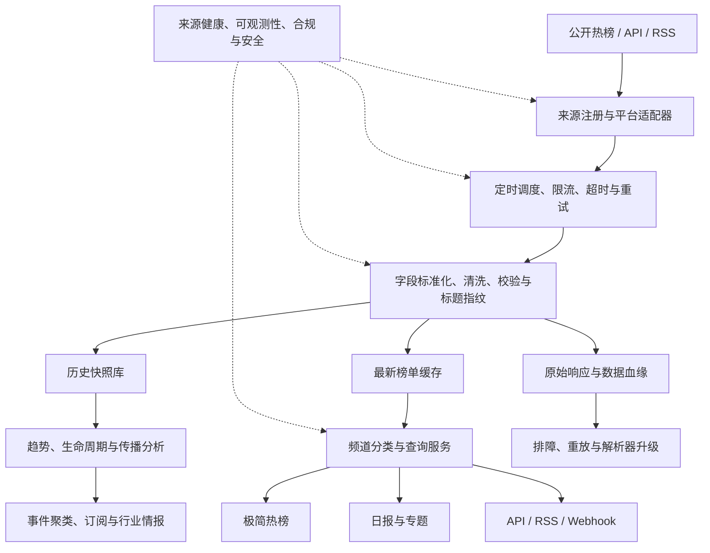

# Open2Hub REBANG 详细研究

## 一、直接结论

Open2Hub 的 REBANG 产品本质上是一个以中文互联网平台为主的公开热榜索引与导航服务：定时获取公开榜单，提取标题、排名和链接，整理成统一页面，并把阅读流量导回原平台。

它当前解决的是“现在各平台在关注什么”，不是完整的搜索引擎、新闻数据库或舆情分析系统。真正值得研究的不是页面样式本身，而是来源目录、平台适配、统一字段、缓存输出和长期维护这些基础能力。

## 二、可确认能力

- 多源聚合：覆盖综合、新闻、财经、科技、娱乐、体育、视频和其他八个频道。
- 子榜拆分：同一平台可以接入多个子榜，例如 B 站内容分区、虎扑体育分区、豆瓣图书与影音榜单。
- 定时更新：页面显示不同榜单的更新时间；官方说明采集时段为每天 9:00—21:00。
- 索引跳转：保存并展示标题与链接，点击后进入来源平台。
- 日报输出：按日期展示重要事件摘要及对应出处链接。
- 服务端预处理：初始 HTML 已包含榜单条目，浏览器不需要再直接请求几十个平台才能完成首屏展示。

2026-09-05 对八个频道的快照统计为 131 个榜单卡片、72 个不同来源名称。完整清单见 [SOURCES.md](SOURCES.md)。该数量属于时间点快照，不构成长期固定承诺。

## 三、GitHub 与源码判断

### 关联仓库

1. [`zhaochenchen/REBANG`](https://gitee.com/zhaochenchen/REBANG) 位于 Gitee，仓库根目录目前只有 `README.md` 和 `README.en.md`。
2. README 中的 GitHub 链接为 `github.com/yourusername/rebang`，属于模板占位地址。
3. [`open2hub/open2hub.github.io`](https://github.com/open2hub/open2hub.github.io) 确实存在，但仓库中的 `CNAME` 指向 `blog.open2hub.com`，内容是静态博客而不是热榜采集器。

### 判断

截至本次整理，没有发现可以确认是 REBANG 当前生产系统的完整公开源码。因此无法从源码确认具体后端框架、数据库、定时器、每个平台的请求入口或失败重试实现。

公开 README 曾描述“纯前端直连平台 API”，但当前网站首个 HTML 响应已经包含榜单数据，且页面脚本主要负责频道状态和页面交互。现网更符合“提前采集并缓存，再生成或渲染页面”的形态。公开 README 应视为产品介绍或早期方案，不能代替现网实现证据。

## 四、数据是如何获取的

### 官方可以确认

根据 [官方说明](https://top.open2hub.com/rebang-about.html)：

- 只访问各平台公开可见的热榜页面；
- 不突破技术防护，不获取非公开数据；
- 只缓存标题和链接等索引信息；
- 不保存或传输第三方正文、图片和音视频；
- 用户点击后直接进入原平台。

### 工程上可以合理推断

不同平台的结构并不一致，因此一个可维护的实现通常需要：

1. 建立来源注册表，记录平台、子榜、频道、地址和更新频率。
2. 为每个平台实现获取与解析适配器，处理公开 API、HTML 榜单或 RSS。
3. 由定时任务执行采集，控制并发、限流、超时和失败重试。
4. 把结果映射为统一字段，例如来源、榜单、排名、标题、链接和采集时间。
5. 校验空榜、异常条数、无效链接和页面结构变化。
6. 缓存最新结果，再生成静态页面或通过服务端模板输出。

### 目前不能确认

- 每个平台具体使用哪个请求地址；
- 使用官方接口、页面内部接口还是 HTML 解析的精确比例；
- 是否使用第三方热榜 API；
- 反爬、代理、账号、Cookie 和验证码策略；
- 数据库、缓存和调度框架；
- 日报由人工、规则还是大模型生成。

## 五、详细能力架构

外部 README 使用更精简的六模块图；本图用于研究和开发拆解，不代表 REBANG 已经实现所有增强模块。

## 六、适用场景

- 个人阅读：用一个入口浏览多个平台的当日热点。
- 内容运营：发现选题、比较不同圈层的关注差异。
- 品牌与公关：作为品牌词和风险事件的低成本候选信号。
- 产品与战略：扫描行业、公司、政策和消费趋势。
- AI Agent：作为发现候选事件的上游输入，再进入核查和分析流程。

不适合作为证券交易依据、事实真实性结论、跨平台绝对热度比较或 7×24 小时重大舆情告警系统。

## 七、可扩展方向

1. **可靠采集**：来源健康度、结构变化检测、失败降级和解析器版本管理。
2. **历史资产**：保存排名、采集时间和生命周期，形成可回溯的趋势数据。
3. **事件理解**：跨平台去重、相似标题聚类、实体识别和主题演化。
4. **指标体系**：计算排名速度、持续时间、覆盖来源和传播路径；不同平台热度需要校准后再比较。
5. **可信治理**：来源等级、出处引用、多源交叉验证和争议标记。
6. **业务交付**：搜索、订阅、企业微信或飞书告警、API、RSS、Webhook 和数据导出。
7. **垂直情报**：围绕 AI、游戏、出海、消费品牌或金融等领域建立行业词表与业务反馈闭环。

## 八、对团队的意义

REBANG 证明了跨平台热点入口的基础需求，但“展示榜单”本身门槛不高。团队真正可以沉淀的资产包括：

- 持续维护的来源目录和适配器；
- 稳定、可追溯的统一数据契约；
- 长期历史快照和质量指标；
- 跨平台事件聚类与行业语义；
- 与内部决策、内容生产和风险处置相连接的工作流。

建议开发顺序是：先完成来源、适配器、标准化、缓存和页面；再补历史、搜索、订阅和告警；最后建设事件聚类、传播分析、可信核查和行业情报。

## 九、局限与风险

- 上游页面和非正式接口可能随时改变。
- 平台榜单本身包含算法、运营和商业规则，不代表完整社会关注度。
- 不同来源的排名和热度口径不能直接横向比较。
- 标题只适合发现线索，不能替代阅读原文和事实核查。
- 对外提供服务前应核对平台条款、访问频率、版权、隐私和数据保存范围。
- 没有公开生产源码意味着本研究只能解释可观察能力，不能为内部实现细节背书。

## 十、参考资料

- [REBANG 首页](https://top.open2hub.com/)
- [官方说明](https://top.open2hub.com/rebang-about.html)
- [极简日报](https://top.open2hub.com/daily/last)
- [关联 Gitee 仓库](https://gitee.com/zhaochenchen/REBANG)
- [Open2Hub GitHub 静态博客仓库](https://github.com/open2hub/open2hub.github.io)
