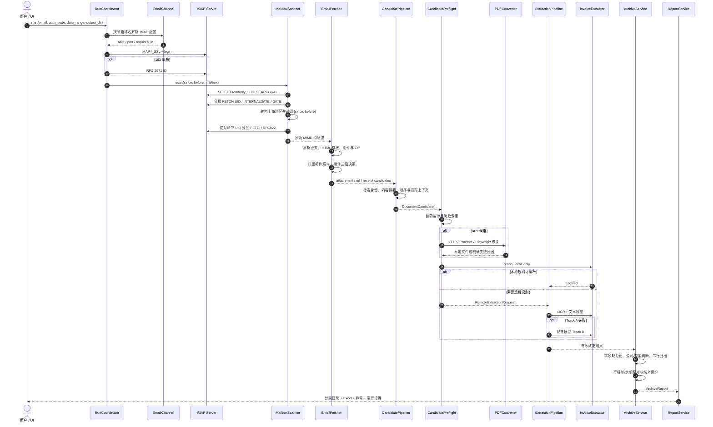
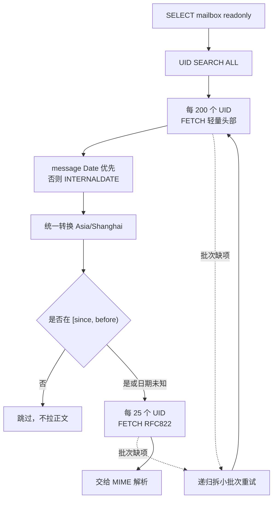
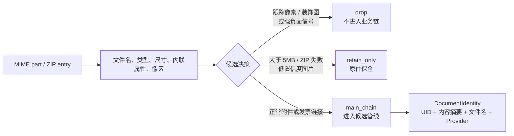
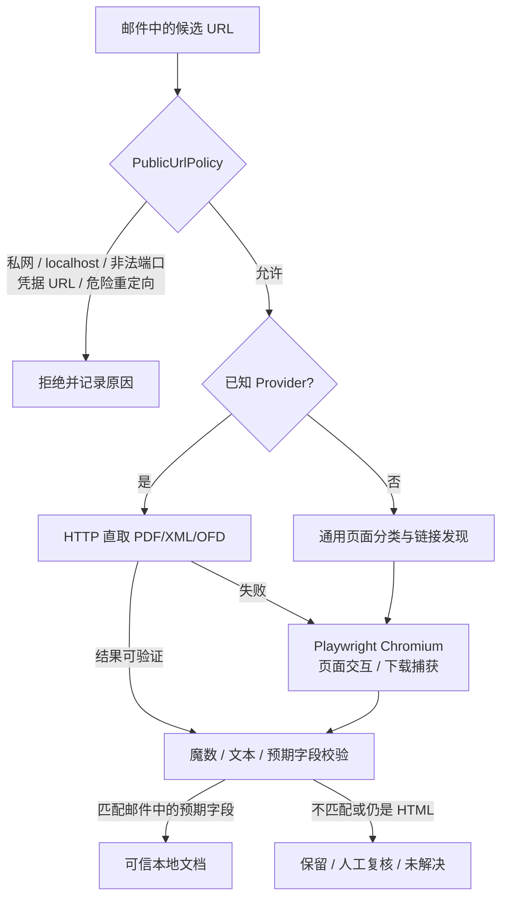
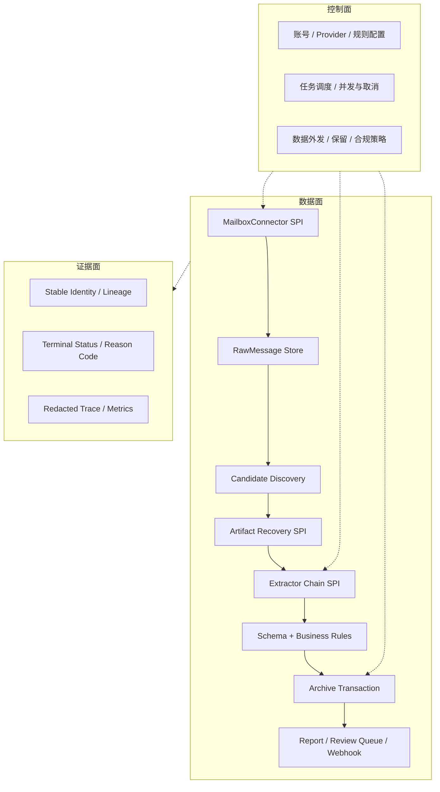

# InvoiceFlowAI 实现逻辑与同类系统建设指南

本文把源码中的真实实现与推荐的参考架构分开描述。标记为“当前实现”的内容来自研究版本 `1b884e9`；标记为“建设建议”的内容是为了后续实现类似系统所作的工程抽象。

## 1. 完整处理时序



这个时序说明了一个重要原则：**邮件读取、内容识别和文件归档是三个不同事务域**。把它们揉进一个循环，短期代码更少，长期却很难重试、去重、审计和人工复核。

## 2. 模块地图

| 模块 | 关键源码 | 输入 → 输出 | 当前实现逻辑 | 可复用设计 |
| --- | --- | --- | --- | --- |
| UI 与应用边界 | `main.py`、`app_api.py` | 用户参数 → `RunRequest` | PyWebView/WebView2 桌面端；`app_api` 连接设置、状态、流水线和导出器 | UI 只启动任务和展示状态，不承载业务流程 |
| 运行编排 | `run_coordinator.py`、`run_lifecycle.py` | `RunRequest` → `RunResult` | 按扫描、恢复、识别、归档、报告阶段推进；锁阻止并发运行 | 用显式阶段和终态代替散落布尔值 |
| 邮箱通道 | `email_channel.py` | 邮箱地址 → 连接配置 | QQ 与 163 注册表；163 需要 IMAP ID | Provider 差异封装为通道适配器 |
| 邮箱扫描 | `mailbox_scanner.py` | 时间区间 → 原始邮件 | UID 搜索、头部批次 200、正文批次 25、上海时区过滤、缺失批次递归拆分 | 轻量索引与重载荷内容分阶段拉取 |
| MIME 与候选发现 | `email_fetcher.py` | 原始邮件 → 原始候选 | 正文/HTML/附件解码，四层漏斗，ZIP 递归，图片噪声过滤，URL 分组 | 发现阶段只生成候选与原因，不执行最终业务动作 |
| 候选契约与预检 | `candidate_pipeline.py` | 原始候选 → `DocumentCandidate` / 预检结果 | 不可变身份、稳定顺序、内容摘要、运行内/历史去重、本地预检 | 用反腐层隔离多变输入与稳定核心 |
| 链接恢复 | `pdf_converter.py`、`provider_*.py` | URL → 本地文档 | HTTP 直取优先，平台适配器次之，Playwright 兜底；按预期字段验证下载物 | 恢复和识别分开，避免把错误页面当发票 |
| URL 安全 | `url_security.py` | URL/重定向 → 允许或拒绝 | 限制协议、端口、私网地址、凭据 URL，检查 DNS、重定向与连接对端 | 所有服务器端 URL 获取必须统一经过安全策略 |
| 提取与降级 | `extraction_pipeline.py`、`invoice_extractor.py`、`glm_runtime.py` | 本地文件 → `ExtractionOutcome` | 本地专用解析；Track A OCR+文本模型；Track B 视觉模型；配额/鉴权熔断 | 便宜、确定、隐私更好的路径优先，模型负责长尾 |
| 业务验收 | `document_acceptance.py`、`company_rules.py`、`document_types.py` | 识别字段 → 业务决策 | 日期金额等规范化，公司归属，类型注册，未知项转人工 | 模型输出只能是候选事实，不能直接驱动归档 |
| 归档与幂等 | `archive_service.py`、`app_archive_adapter.py` | 终态结果 → 目录和记录 | 文件副作用串行；按身份/业务键去重；失败保全；未解决项阻止“成功完成” | 识别可并行，文件副作用集中串行提交 |
| 凭证配对 | `pairing_engine.py`、`archive_pairing_service.py` | 已归档文档 → 配对关系 | 金额、Provider、商户词、邮件 UID、日期窗口打分；多解时拒绝猜测 | 先生成候选图，再做确定配对；歧义必须显式化 |
| 报表与证据 | `report_service.py`、`run_evidence.py`、`run_state_store.py` | 归档报告 → Excel/证据/状态 | 汇总、成功明细、异常记录、文件哈希、行程轨迹、版本和硬件指纹 | “运行成功”应由可验证工件和终态共同定义 |
| 安全设置 | `user_settings.py`、`url_trace_sanitizer.py` | 敏感配置/追踪数据 → 安全存储 | Windows DPAPI、macOS Keychain；URL/主题/发件人散列或删减 | 机密、业务内容和诊断数据分别治理 |

## 3. 邮件如何获取

### 3.1 建立连接

当前实现不依赖专门的 QQ 邮箱 API 或网易邮箱 API，而是标准 IMAP：

1. 用户提交邮箱地址和 IMAP 授权码。
2. `email_channel` 从邮箱域名解析通道配置。
3. QQ 使用 `imap.qq.com:993`；163 使用 `imap.163.com:993`。
4. `EmailFetcher.connect()` 创建 `imaplib.IMAP4_SSL` 连接并登录。
5. 163 通道额外发送 RFC 2971 `ID`，满足服务端客户端标识要求。

授权码与网页登录密码不是同一概念。建设类似系统时，配置页应明确提示用户在邮箱后台开启 IMAP 并生成专用授权码；不要收集主密码。

### 3.2 两阶段扫描



这里有四个值得照搬的细节：

- `SELECT readonly=True` 避免扫描改变已读标记。
- 日期区间采用左闭右开 `[since, before)`，便于按月任务无重叠拼接。
- 邮件头日期优先，缺失时回退到服务器 `INTERNALDATE`；两者都不可用时宁可保留，避免漏件。
- IMAP 服务可能在一次批量 FETCH 中漏回个别 UID，因此对缺项递归拆批重试，而不是把整批判失败或静默丢失。

### 3.3 建设建议

生产系统应再补三类机制：

- 使用 `UIDVALIDITY + last_seen_uid` 做增量游标，并在 UIDVALIDITY 变化时安全重建索引。
- 把原始邮件按内容摘要写入只读对象存储或短期证据区，使后续解析可重放而无需再次访问邮箱。
- 将 Provider、文件夹、扫描窗口、服务端响应和重试原因写入结构化运行记录，但不要记录授权码或完整正文。

## 4. 邮件内容如何拆分成候选

### 4.1 MIME 展开

`EmailFetcher` 使用 Python 邮件库解析 MIME 树：

- `text/plain` 直接解码为正文；
- `text/html` 用 BeautifulSoup 提取可读文本和所有链接；
- 带文件名或附件处置的 part 解码为二进制文件；
- ZIP 进入递归队列继续枚举；
- 某些正文中已包含完整收据信息的邮件，会生成合成 PDF 进入统一流程。

### 4.2 四层邮件漏斗

系统按已知发件域、主题关键词、正文关键词以及图片/二维码线索评估邮件。其目的不是判断“这一定是发票”，而是缩小后续昂贵处理的候选集。

### 4.3 附件三级决策



`retain_only` 很重要：它表示系统暂时不会自动识别，但原件不能丢。文档自动化的目标不是追求 100% 自动化率，而是让“自动成功、等待人工、明确失败”都可解释且不丢数据。

### 4.4 当前实现的格式缺口

源码常量 `VALID_EXTENSIONS` 当前仅包含 `.pdf`、`.jpg`、`.jpeg`、`.png`。ZIP 枚举阶段虽然会识别 `.ofd` 和 `.xml`，后续通用处理条件仍可能把它们跳过；直接 MIME 附件也存在相同不一致。若基于该项目二次开发，应先统一：

```text
发现白名单 = 解包白名单 = 本地解析器支持列表 = UI 能力声明
```

并为每种格式建立“直接附件、ZIP 内附件、链接下载、大小写后缀、错误内容”五类契约测试。

## 5. 候选数据契约为什么是核心

`CandidatePipeline` 把松散字典转换为不可变、按发现顺序排列的 `DocumentCandidate`。建议同类系统至少保留以下字段：

```text
DocumentIdentity
  document_id       稳定业务身份
  source_digest     URL 规范化摘要或文件内容 SHA-256
  message_uid       来源邮件 UID

DocumentCandidate
  identity          不可变身份
  sequence          原始发现顺序
  channel           attachment / url / receipt / zip
  source_path/url   当前材料位置
  filename          期望文件名
  provider_group    下载平台或供应商组
  trace_context     可脱敏的来源上下文
  action            main_chain / retain_only / manual_review / skip
```

稳定身份同时解决四个问题：

1. 当前运行中相同附件或链接的重复发现；
2. 跨运行重复下载和重复归档；
3. 并行识别完成顺序变化后的结果重排；
4. Excel、异常、原文件和来源邮件之间的血缘追踪。

## 6. 下载链接如何恢复为文档

邮件中的“下载发票”经常是网页而非文件。当前实现的恢复顺序是：



恢复环节最容易出现两类严重错误：服务端请求伪造（SSRF），以及下载到了错误文件却继续识别。`PublicUrlPolicy` 处理协议、端口、私网 IP、DNS、重定向和连接对端；Provider 适配器再用邮件中可获得的发票字段验证下载物。

建设类似系统时建议让每个 Provider 实现统一接口：

```text
can_handle(url, context) -> confidence
recover(url, context, sandbox) -> RecoveredDocument | RecoveryFailure
validate(document, expected_fields) -> ValidationResult
```

浏览器必须运行在受限临时目录和独立进程中，并限制运行时间、下载总量、重定向次数和网络目的地。不能把 Playwright 当普通 HTTP 客户端无限制使用。

## 7. 识别链如何工作

### 7.1 本地优先

`InvoiceExtractor.probe_local_only()` 先尝试确定性路径，包括 XML、正文合成收据、境外发票、CITS/GBT、打车行程单、酒店水单、标准电子发票和滴滴票据等。能可靠解析时直接返回，不产生模型费用，也不把数据发到外部。

### 7.2 Track A 与 Track B

- **Track A**：如果 PDF 已有可用文字则直接使用；否则把首页渲染为 PNG，调用 `glm-ocr` 获取文字，再调用 `glm-4-flash` 输出严格 JSON。
- **Track B**：Track A 失败时，把图片交给 `glm-4.5v` 视觉模型直接提取。
- **运行时保护**：`glm_runtime` 处理超时、重试、并发、鉴权失败和额度耗尽；鉴权/额度问题会触发熔断，避免队列中每份文档重复失败。

`ExtractionPipeline` 只并行处理明确标记为 `parallel_safe` 的远程识别请求，最大 worker 数为 2；URL/Provider/浏览器相关任务保持串行。最终结果会恢复到候选原始顺序。

### 7.3 桌面版与 DSH 插件差异

| 路径 | OCR | LLM 输入 | 远程视觉 |
| --- | --- | --- | --- |
| 桌面主程序 | GLM OCR 或 PDF 文本 | OCR 文本发送到 GLM 文本模型 | GLM-4.5V 兜底，发送图片 |
| DSH 插件 | 本地 RapidOCR ONNX | OCR 文本发送到当前选择的 DeepSeek 模型 | 可选 GLM 兜底时发送图片 |

因此，“文件在本地整理”和“所有内容不离开本机”不是同一件事。类似系统应在任务开始前显示每条识别路径的数据出境范围，并允许用户强制本地模式。

## 8. 为什么识别之后还要业务验收

模型给出的 JSON 只是待验证事实。当前实现还会：

1. 规范化日期、金额、购销方名称、文档类型和发票标识；
2. 按配置的公司名称判断目标公司、非目标公司或未知；
3. 通过文档类型注册表映射到打车、行程单、住宿发票、水单、餐饮、过路费等目录；
4. 对缺字段、未知公司和低置信度结果转人工复核；
5. 对通过验收的文件执行重命名和分类归档。

源码里的“自然语言分类规则”主要作为提示词追加给模型。建设生产系统时，金额阈值、公司主体、费用类型和审批策略应尽量变成可版本化、可单元测试的规则；自然语言可以作为规则编辑入口，但不应是唯一执行表示。

## 9. 归档、去重与凭证配对

`ArchiveService` 把有副作用的文件操作串行化，按文档身份和业务键去重，并累计 `archived`、`retained`、`manual_review`、`unresolved`、`duplicate` 等数量。只要存在未解决的归档结果，运行就不能标记为完整成功。

配对模块用于：

- 打车发票 ↔ 行程单；
- 住宿发票 ↔ 住宿水单。

它先根据角色、金额、Provider 和日期窗口建立兼容关系，再按商户词重合、同一邮件 UID、金额和日期等因素评分，对连通分量求最优分配。如果存在多个同分最优成员关系，就标记歧义而不强行猜测。这种“失败关闭”策略比错配后静默归档更适合财务材料。

## 10. 终态与失败语义

建议不要用单一 `success: true/false`。当前识别链已经区分了更有行动意义的状态：

| 终态 | 含义 | 后续动作 |
| --- | --- | --- |
| `resolved` | 已得到可验收字段 | 进入业务验收与归档 |
| `retained` | 不适合自动处理但已保留原件 | 人工决定是否继续 |
| `manual_review` | 识别或业务判断不确定 | 进入复核队列 |
| `unresolved` | 所有可用路径均未解决 | 保留证据并使运行非完整成功 |
| `duplicate` | 当前或历史已处理 | 不重复归档，记录指向原结果 |
| `quota_exhausted` | 模型额度不足 | 熔断远程队列，提示补充额度或本地处理 |
| `auth_failed` | 模型鉴权失败 | 熔断并要求修复凭据 |
| `timeout` | 外部服务或恢复过程超时 | 按幂等策略重试或转人工 |
| `cancelled` | 用户取消 | 停止新任务，安全完成已开始的提交 |

推荐把每个状态再配上结构化 `reason_code`、面向用户的 `message`、可重试标记和证据引用。这样监控、人工队列和自动重试都不需要解析日志文本。

## 11. 建设同类系统的推荐架构

下面是基于原项目经验整理的目标边界，不等同于源码已经完整实现：



建议把可变能力做成三个 SPI：

- `MailboxConnector`：IMAP、Gmail API、Microsoft Graph、企业邮箱；
- `ArtifactRecovery`：直接附件、网页下载、Provider 浏览器自动化、二维码；
- `Extractor`：本地规则、OCR、文本模型、视觉模型、特定票据解析器。

稳定核心只负责候选身份、状态机、业务规则、归档事务和证据血缘。这样更换邮箱或模型时，不会重写整个流程。

## 12. 分阶段实现路线

### P0：可靠收件与原件保全

- IMAP 只读连接、授权码校验、时间窗口扫描；
- MIME 解析、附件落盘、SHA-256 和来源 UID；
- 幂等游标、重复检测、失败保留目录；
- 可重放的任务记录。

**验收标准**：同一时间窗口重复运行不会产生重复文件；网络中断后可安全重试；任何被系统发现的材料都有终态。

### P1：确定性解析与业务归档

- PDF/XML/OFD 统一格式注册表；
- 可选 PDF 文本提取和结构化正则；
- 公司、类型、日期、金额等规则；
- 分类命名和 Excel 汇总。

**验收标准**：模型完全关闭时，确定性格式仍可完成；规则均有输入输出样例和单元测试。

### P2：模型降级与人工复核

- 本地 OCR 优先；文本模型结构化；视觉模型长尾兜底；
- 严格 JSON Schema 校验、额度与鉴权熔断；
- 人工复核队列、修改记录和反馈样本。

**验收标准**：模型故障不会丢原件或阻塞可本地处理的文档；人工修改可追踪到模型版本和来源材料。

### P3：链接恢复与多通道扩展

- Provider 适配器、URL 安全策略、受限浏览器沙箱；
- Gmail API / Microsoft Graph / 企业邮箱连接器；
- Webhook、对象存储、审批系统和财务系统输出适配器；
- 真实样本回归集和可观测性指标。

**验收标准**：每个 Provider 有契约测试与真实页面探针；恢复失败不会误归档 HTML、登录页或他人发票。

## 13. 推荐主流程伪代码

```python
def run(request):
    context = lifecycle.start(request)
    channel = mailbox_registry.resolve(request.email)

    with channel.connect(request.credential) as mailbox:
        message_refs = mailbox.scan_headers(request.window)

        for raw_message in mailbox.fetch_messages(message_refs):
            raw_id = raw_store.put_if_absent(raw_message)

            for discovered in candidate_discovery.expand(raw_message):
                candidate = identity_factory.freeze(raw_id, discovered)

                if history.is_duplicate(candidate.identity):
                    outcomes.append(Outcome.duplicate(candidate))
                    continue

                artifact = recovery_chain.materialize(candidate)
                extraction = extractor_chain.extract(artifact, request.policy)
                outcome = acceptance_gate.decide(candidate, extraction)
                outcomes.append(outcome)

    archive_report = archive_service.commit_in_order(outcomes)
    report = report_service.finalize(context, archive_report)
    return lifecycle.complete_only_if_terminal(report)
```

注意：实际实现应把网络、恢复和模型步骤做成有界并发，并让所有文件提交集中在 `archive_service`；伪代码强调的是边界和顺序，不是要求单线程处理全部候选。

## 14. 优先复用与优先重写

### 优先复用的思想

- 两阶段邮箱扫描与拆批重试；
- 不可变候选身份和顺序恢复；
- 本地优先、模型兜底的提取链；
- 明确终态、原因码和失败原件保全；
- 并行识别、串行归档；
- 配对歧义时拒绝猜测；
- URL 获取前置安全策略和下载物验证。

### 优先重写或加强的部分

- 将 QQ/163 硬编码注册表升级为连接器插件；
- 统一 PDF/OFD/XML 的发现、解包、解析和能力声明；
- 给 ZIP 增加深度、文件数、压缩比和解包总量限制；
- 给 Playwright 增加进程级资源、网络和下载沙箱；
- 将自然语言业务规则编译为可审计规则，而非只拼入模型提示词；
- 把敏感数据外发策略和模型路由做成显式控制面；
- 用真实脱敏样本建立格式、Provider、模型与归档的端到端回归集。

## 15. 评估类似项目时应问的问题

1. 邮箱是只读读取吗，使用授权码、OAuth 还是主密码？
2. UID、时间区间和增量游标能否保证不重不漏？
3. 邮件、附件、ZIP 内容、链接和二维码是否都进入统一候选契约？
4. 每个候选是否有稳定身份、来源血缘和终态？
5. URL 恢复是否防 SSRF，并验证下载物确实属于这封邮件？
6. 本地解析、OCR、LLM 和视觉模型的顺序、成本与隐私边界是什么？
7. 模型结果是否经过 Schema 和业务规则验收？
8. 失败、低置信度、重复和歧义是否都有原件保全和人工入口？
9. 文件移动是否幂等、可恢复，并与并发识别隔离？
10. 最终“成功”是否由全部候选进入终态和证据完成共同定义？

如果这十个问题没有清楚答案，系统可能只是一个能跑的脚本，还不是可长期运行的文档处理平台。

