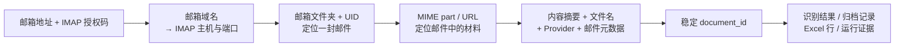

# InvoiceFlowAI 邮件发票处理架构

> 将 InvoiceFlowAI 拆解为“邮箱接入—MIME 候选发现—链接恢复—分层识别—业务验收—归档报表”六段流水线，说明邮件如何关联、文档如何流转，以及建设同类系统时应复用哪些边界。

## 一句话结论

它不是一个新的邮件协议或发票大模型，而是一套完成度较高的**文档工作流编排**：通过标准 IMAP 读取 QQ / 163 邮箱，把 MIME 附件、正文和下载链接转换成稳定的文档候选，再用“本地确定性解析优先、模型识别兜底”的方式提取字段，最后完成业务校验、去重归档、凭证配对和 Excel 汇总。

真正值得参考的不是“读取邮件”本身，而是它如何处理真实业务中的不确定性：批量拉取不完整、附件噪声、下载链接失效、模型配额耗尽、重复文件、归属公司不明和多解配对等问题。

## 项目信息

- 原仓库：<https://github.com/EthanYoQ/Invoice-Downloader>
- 产品名称：InvoiceFlowAI
- 研究版本：`1b884e96775b04acc35518ddcd52be8abe6b00fd`
- 版本日期：2026-08-29
- 主要技术：Python、IMAP、PyWebView、Playwright、BeautifulSoup、PyMuPDF、GLM、openpyxl
- 许可证：Apache-2.0
- 研究状态：已完成源码级第一版整理
- 最后更新：2026-09-05

## 能力边界

| 能力 | 当前实现 | 应如何理解 |
| --- | --- | --- |
| 邮箱连接 | QQ、163 邮箱，IMAP over SSL | 没有厂商专用邮件 API；用户提供邮箱地址和 IMAP 授权码 |
| 时间范围扫描 | UID 全量搜索、分批读取头部、按上海时区过滤 | 先读轻量头部再取正文，减少无效下载 |
| 邮件内容发现 | MIME 附件、HTML 链接、正文收据、ZIP 内容 | 核心是“候选发现”，不是简单按附件后缀保存 |
| 发票链接恢复 | HTTP 直取、平台适配、Playwright 浏览器兜底 | 适合处理邮件中只有下载按钮或临时链接的情况 |
| 字段识别 | 本地规则解析 → OCR + 文本模型 → 视觉模型 | 模型是降级链的一环，不是唯一处理器 |
| 业务判断 | 公司归属、文档类型、字段规范化、人工复核 | 识别成功不等于业务可接受 |
| 文件归档 | 去重、重命名、分类、发票与凭证配对 | 有副作用的文件操作集中串行执行 |
| 结果输出 | Excel 汇总、异常记录、运行证据与状态 | 以可审计的终态结束一次运行 |

## 概览架构

```mermaid
flowchart LR
    UI["桌面端 PyWebView<br/>或 DSH 侧边栏"] --> APP["应用编排<br/>app_api / RunCoordinator"]

    subgraph A["1. 邮箱接入"]
        CH["email_channel<br/>域名 → IMAP 配置"] --> IMAP["EmailFetcher<br/>SSL 登录 / 163 ID"]
        IMAP --> SCAN["MailboxScanner<br/>UID + 日期过滤 + 分批抓取"]
    end

    subgraph B["2. 候选发现"]
        MIME["MIME 解析<br/>正文 / HTML / 附件"] --> FUNNEL["四层邮件漏斗<br/>发送域 / 主题 / 正文 / 图片"]
        FUNNEL --> CAND["DocumentCandidate<br/>不可变身份 + 顺序 + 来源"]
    end

    subgraph C["3. 文档恢复"]
        PREFLIGHT["CandidatePreflight<br/>去重 / 保留 / 预检"] --> RECOVER["PDFConverter<br/>HTTP / Provider / Playwright"]
        RECOVER --> SAFE["PublicUrlPolicy<br/>SSRF 与重定向校验"]
    end

    subgraph D["4. 分层识别"]
        LOCAL["本地确定性解析<br/>XML / PDF 文本 / 专用票据"] --> TRACKA["Track A<br/>OCR → 文本模型"]
        TRACKA --> TRACKB["Track B<br/>视觉模型兜底"]
    end

    subgraph E["5. 业务验收"]
        ACCEPT["字段规范化<br/>DocumentAcceptance"] --> COMPANY["公司归属规则"]
        COMPANY --> TYPE["文档类型注册表"]
    end

    subgraph F["6. 归档与输出"]
        ARCHIVE["ArchiveService<br/>串行副作用 + 幂等"] --> PAIR["PairingEngine<br/>行程单 / 水单配对"]
        PAIR --> REPORT["分类目录 / Excel<br/>人工复核 / 运行证据"]
    end

    APP --> CH
    SCAN --> MIME
    CAND --> PREFLIGHT
    PREFLIGHT --> LOCAL
    SAFE --> LOCAL
    TRACKB --> ACCEPT
    TYPE --> ARCHIVE

    SETTINGS["横向能力：凭据安全 · 生命周期状态 · 原因码 · 脱敏追踪 · 失败保全"] -.-> APP
    SETTINGS -.-> CAND
    SETTINGS -.-> ARCHIVE
```

架构中的关键分界是：

1. 邮件层只负责可靠获取原始材料，不决定报销业务结果。
2. 候选层用稳定身份隔离“邮件格式”与“文档处理”。
3. 识别层输出结构化结果和明确终态，不直接移动文件。
4. 业务层复核模型结果，归档层统一执行有副作用的动作。

## 一封邮件如何与最终文件关联

系统没有调用 QQ 或 163 的专用业务 API。关联关系来自 IMAP 和程序生成的稳定文档身份：

- **账号关联**：用户输入邮箱地址，`email_channel.py` 根据域名选择 `imap.qq.com:993` 或 `imap.163.com:993`；`EmailFetcher.connect()` 使用 `imaplib.IMAP4_SSL` 和授权码登录。163 邮箱额外发送 RFC 2971 `ID` 命令。
- **邮件关联**：IMAP 的邮箱文件夹和 UID 标识原始邮件；日期、主题、发件人等进入追踪上下文。
- **文档关联**：每个附件或链接结合内容摘要、文件名、Provider 分组和邮件 UID 生成 `document_id`。同一材料重复出现时，可在当前运行或历史记录中识别为重复。
- **业务关联**：归档、Excel 行和异常记录都沿用该身份与追踪上下文，因此可以从结果反查来源邮件，而不是仅依赖最终文件名。

## 详细实现文档

[实现逻辑与同类系统建设指南](ARCHITECTURE.md)进一步展开：

- IMAP 扫描为什么采用“两阶段拉取”和递归拆批重试；
- MIME 内容如何经过三级附件决策进入候选池；
- 下载链接如何在 HTTP、Provider 适配器和浏览器自动化之间降级；
- 本地解析、OCR、文本模型与视觉模型如何组成识别链；
- 为什么业务验收、文件副作用、凭证配对必须放在识别之后；
- 建设类似系统时应采用的数据契约、状态机、里程碑和验收标准。

## 研究判断

这个项目的**算法创新价值有限，工程参考价值中高**。如果研究目标是邮件协议、OCR 模型或发票语义算法，它不会提供显著的新理论；如果目标是落地一套长期可运行的“邮箱驱动文档自动化”，它提供了很具体的失败处理、候选身份、降级链、人工兜底和证据闭环设计。

建议复用其模块边界和状态语义，但不要直接照搬全部实现：邮件 Provider 应进一步插件化，ZIP 和浏览器恢复需要更强资源隔离，敏感数据外发策略需要显式配置，业务规则也应从模型提示词迁移到可测试的规则层。

## 验证与已知差异

- 源码检查覆盖桌面主链路和 DSH 插件链路；两者识别策略并不完全相同。
- 桌面版会在需要时把发票图片或 OCR 文本发送给 GLM；DSH 默认用本地 RapidOCR，再把 OCR 文本交给当前模型。二者都不能笼统描述为“完全离线”。
- README 宣称支持 PDF / OFD / XML；但当前 `email_fetcher.py` 的直接附件白名单只有 PDF/JPG/JPEG/PNG，ZIP 扫描虽发现 OFD/XML，后续通用处理仍可能跳过。这是当前主干值得修复或补测的能力缺口。
- 源码测试运行结果为 768 项中 767 项通过；唯一失败是硬件指纹绑定的性能基线不匹配。DSH 插件测试 19 项全部通过。未使用真实邮箱、真实 GLM 密钥或真实浏览器下载链路做外部端到端验证。

## 图片说明

图片来源、版本和文字说明记录在 [images/README.md](images/README.md)。

## 参考源码

- [应用入口与桌面 UI](https://github.com/EthanYoQ/Invoice-Downloader/blob/1b884e96775b04acc35518ddcd52be8abe6b00fd/main.py)
- [运行编排器](https://github.com/EthanYoQ/Invoice-Downloader/blob/1b884e96775b04acc35518ddcd52be8abe6b00fd/run_coordinator.py)
- [邮箱通道注册表](https://github.com/EthanYoQ/Invoice-Downloader/blob/1b884e96775b04acc35518ddcd52be8abe6b00fd/email_channel.py)
- [邮箱抓取与 MIME 候选发现](https://github.com/EthanYoQ/Invoice-Downloader/blob/1b884e96775b04acc35518ddcd52be8abe6b00fd/email_fetcher.py)
- [IMAP 分批扫描器](https://github.com/EthanYoQ/Invoice-Downloader/blob/1b884e96775b04acc35518ddcd52be8abe6b00fd/mailbox_scanner.py)
- [候选数据契约与预检](https://github.com/EthanYoQ/Invoice-Downloader/blob/1b884e96775b04acc35518ddcd52be8abe6b00fd/candidate_pipeline.py)
- [识别流水线](https://github.com/EthanYoQ/Invoice-Downloader/blob/1b884e96775b04acc35518ddcd52be8abe6b00fd/extraction_pipeline.py)
- [发票提取器](https://github.com/EthanYoQ/Invoice-Downloader/blob/1b884e96775b04acc35518ddcd52be8abe6b00fd/invoice_extractor.py)
- [归档与配对](https://github.com/EthanYoQ/Invoice-Downloader/blob/1b884e96775b04acc35518ddcd52be8abe6b00fd/archive_service.py)

