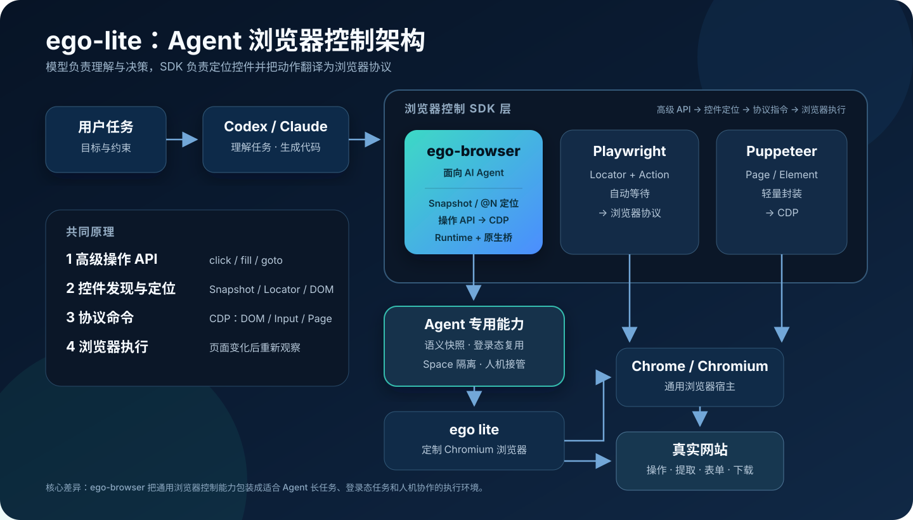
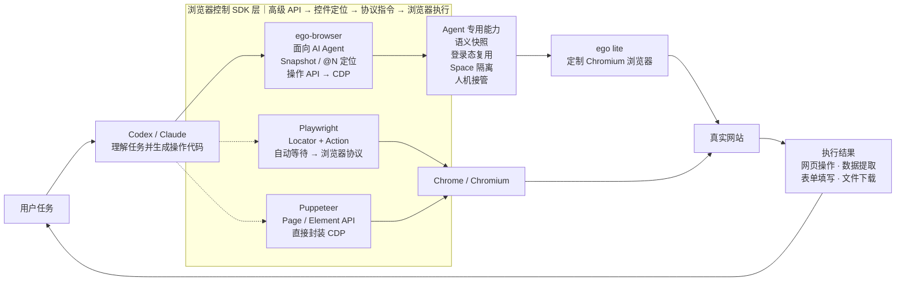

# ego-lite Agent 浏览器控制架构

> 从“模型为什么能够操作浏览器”出发，说明 `ego-browser` 的能力边界、SDK 控制原理、与 Playwright / Puppeteer 的关系，以及它对 Agent 产品架构的启发。



## 一句话结论

`ego-browser` 与 Playwright、Puppeteer 位于同一层，都是**浏览器控制 SDK**。其共同原理是：向上提供点击、输入、导航等 API，在内部定位目标控件，再将操作转换为 CDP 等浏览器底层指令。

它的差异不在“能不能点击网页”，而在于面向 AI Agent 增加了**语义快照、登录态复用、Space 隔离和人机接管**，让模型更容易在真实、已登录、可并行的浏览器环境中完成长任务。

需要特别区分两个概念：

- `ego-browser`：开源的 Node.js 执行与浏览器控制 SDK，负责把 Agent 生成的 JavaScript 变成浏览器动作。
- ego lite：承载 Chromium、Space、Profile 和原生桥接能力的浏览器应用；该应用及 `globalThis.ego` 绑定不在此开源仓库中。

## 项目信息

- 原仓库：<https://github.com/citrolabs/ego-lite>
- 官方文档：<https://lite.ego.app/document/en/docs/product-introduce>
- 研究版本：`5ca3c36cba2240b8df2e22ba32127747029039d5`
- 版本日期：2026-08-24
- 主要技术：TypeScript、Node.js、Chromium、Chrome DevTools Protocol（CDP）
- 开源边界：仓库中的 `ego-browser` 与 Agent Skill 采用 MIT 许可证；ego lite 浏览器应用为独立的闭源组件
- 研究状态：已完成源码、文档与本地测试级整理
- 最后更新：2026-09-05

## 能力边界

| 能力 | 如何实现 | 对 Agent 的价值 |
| --- | --- | --- |
| 浏览器操作 | 导航、点击、输入、键盘、拖拽、滚动、等待、截图、上传与下载 | 覆盖常见网页任务的执行动作 |
| 语义快照 | 将可访问性树整理为紧凑文本，并给可交互节点分配 `@N` 引用 | 模型读取“按钮、输入框、文本”等语义，不必持续处理完整 DOM |
| 控件定位 | 快照引用映射到 CDP `backendNodeId`；长期目标可使用稳定 Locator / CSS | 将模型选择的控件转换为可执行的浏览器节点 |
| 登录态复用 | 使用 Profile 和现有浏览器状态复用 Cookie、Local Storage 与会话 | 可处理邮箱、CRM、后台等需要登录的网站 |
| Space 隔离 | 每个任务使用独立 BrowserContext，隔离页面、Cookie、存储和任务归属 | 多个 Agent 任务可并行执行，减少状态串扰 |
| 人机接管 | 用户与 Agent 可以在同一浏览器任务中交接控制权 | 登录、验证码、最终提交等步骤可由人完成 |
| 深层控制 | 提供网络事件、页面 JavaScript、原始 CDP 等低层入口 | 高级 API 不够时仍可扩展和诊断 |
| 站点经验 | 按站点加载说明、Node 工具和浏览器工具 | 将一次性操作逐步沉淀为可复用能力；自动经验提炼仍在演进 |

## 模块化架构



这张图要表达的核心关系是：**模型负责理解和决策，SDK 负责把决策翻译成可靠的浏览器动作，浏览器负责执行并返回新的页面状态。**

## SDK 层的实现原理

浏览器控制 SDK 本质上是一个“高级操作到浏览器协议”的翻译器，而不是浏览器本身。

1. **任务转成代码**：Codex、Claude 等 Agent 根据用户目标生成一段 JavaScript 操作流程。
2. **SDK 提供统一接口**：`page`、`browser`、`taskSpaces`、`site`、`fetch`、`cdp` 等 Facade 将导航、观察、点击、输入和等待包装为稳定 API。
3. **发现和定位控件**：浏览器通过 DOM 与可访问性树暴露页面结构。`ego-browser` 将可访问性树压缩为语义快照，并把 `@N` 引用映射到浏览器节点；它不是像人一样“认识按钮”，而是读取浏览器已经提供的角色、名称、状态和节点关系。
4. **转换为底层指令**：SDK 把 `click`、`fill`、`press` 等动作转换为 CDP 的 DOM、Input、Page、Network、Runtime 等命令。
5. **跨进程执行**：Node.js Runtime 通过 `globalThis.ego` 原生桥连接 ego lite 浏览器进程，由定制 Chromium 在真实网页中执行指令。
6. **观察—行动循环**：页面变化后重新获取快照或事件，Agent 根据新状态决定下一步，直到得到结果或交给用户。

```text
用户目标
  ↓
Agent 规划并生成 JavaScript
  ↓
ego-browser Facade / Runtime
  ↓
Snapshot / Locator 找到目标节点
  ↓
CDP 命令（DOM / Input / Page / Network / Runtime）
  ↓
ego lite Chromium 执行动作
  ↓
新页面状态返回 Agent，继续下一轮
```

因此，控制浏览器通常依赖三种“看网页”的方式：

- **DOM / Locator**：结构明确、稳定，适合传统自动化。
- **可访问性树 / Snapshot**：文本更紧凑、语义更直接，适合大模型选择控件。
- **截图 / 坐标**：适合 Canvas、图片按钮或结构不可访问的页面，但稳定性较低，应作为补充。

## 与类似方案的关系

| 方案 | 所在层 | 主要观察方式 | 主要特点 | 更适合 |
| --- | --- | --- | --- | --- |
| `ego-browser` | 浏览器控制 SDK + Agent Runtime | 语义 Snapshot、Locator、页面 JS、CDP | 登录态复用、Space 隔离、人机接管、站点经验 | 真实登录态的 Agent 网页任务 |
| Playwright | 通用浏览器自动化 SDK | DOM、Locator、可访问性信息 | 跨浏览器、自动等待、测试生态成熟 | E2E 测试和确定性自动化 |
| Puppeteer | 浏览器自动化 SDK | DOM、Element、CDP | API 较轻，接近 Chromium / CDP | Chromium 自动化和底层控制 |
| browser-use / agent-browser | Agent 浏览器工具层 | DOM / 可访问性快照 / Agent 友好引用 | 将通用浏览器控制重组为模型容易调用的工具 | Agent 网页操作与快速集成 |
| Codex Computer Use | 更广义的计算机操作能力 | 截图、视觉理解、可操作 UI | 不只控制浏览器，也可覆盖桌面应用 | 跨网页与桌面软件的任务 |

`ego-browser` 不是“大模型”，也不是另一种网页协议。它是 Agent 与浏览器之间的**执行基础设施和适配层**。

## 典型使用场景

- 在用户已登录的 CRM、ERP、运营后台中查询和录入数据。
- 处理邮箱、社交平台、私有文档等无法只靠公开 HTTP 抓取完成的任务。
- 自动填写多步表单、批量下载报表、上传文件和整理结果。
- 多个任务分别运行在独立 Space 中，避免账号与页面状态互相干扰。
- 在验证码、二次确认、支付、删除等高风险节点暂停并交给用户。
- 进行需要真实浏览器状态的探索式测试、问题复现与网页验证。

以下场景通常无需优先采用它：

- 只查询公开信息时，搜索或 HTTP API 更轻量。
- 高度确定、长期运行的 CI / E2E 测试，Playwright 的生态和断言体系更成熟。
- 纯 Canvas、远程桌面或视觉密集页面，仅靠语义快照可能无法稳定定位。
- 支付、删除、发布等不可逆流程，不应在缺少审批策略时完全自动执行。

## 对我们的意义

1. **浏览器可以成为 Agent 的通用业务接口**：没有 API 的系统仍然可以通过现有网页完成“最后一公里”。
2. **模型与执行器应解耦**：模型负责理解、规划和异常决策；SDK 负责可验证、可重试的具体动作。
3. **Agent 浏览器的壁垒不只是点击能力**：真正决定可用性的，是登录态、任务隔离、可观察性、人机边界和失败恢复。
4. **语义快照是重要的中间表示**：它连接了网页的机器结构与模型的语言推理，比反复输入完整 DOM 更紧凑，也比纯坐标更稳定。
5. **自动化必须保留人工出口**：真实业务里总有验证码、授权、歧义和高风险确认，人机接管应是架构能力而不是异常补丁。
6. **经验可以产品化**：把站点知识、稳定 Locator、异常处理和工具封装沉淀为 Skill，能够让一次探索变成下一次的可靠执行。

如果我们建设类似能力，最值得复用的不是某个 `click()` API，而是下面这组分层：

```text
任务理解层 → 执行计划层 → Agent 浏览器 SDK → 隔离的浏览器会话 → 审计 / 审批 / 人机接管
```

## 可扩展方向

| 方向 | 可扩展内容 |
| --- | --- |
| 多模态观察 | 将语义快照、DOM、截图和 OCR 融合，为 Canvas 与非标准控件提供稳定回退 |
| 定位鲁棒性 | 自动生成稳定 Locator，结合候选排序、页面变化检测和失败后的重新定位 |
| 安全治理 | 域名白名单、敏感字段脱敏、动作风险分级、提交前审批和最小权限 Profile |
| 可观测与回放 | 记录快照、CDP 事件、网络请求、截图和操作轨迹，支持审计与故障复现 |
| 任务可靠性 | 检查点、幂等动作、超时与重试、失败补偿、长任务恢复和结果验收 |
| Skill / 站点能力 | 将网站说明、工具、已验证流程和异常知识版本化，并自动评估是否仍然有效 |
| 协议与平台 | 抽象浏览器桥接接口，支持更多 Chromium 宿主、Windows / Linux 和远程执行环境 |
| 版本治理 | 对浏览器、Runtime、Skill 和快照格式做兼容性约束，减少 API 漂移导致的失效 |

## 当前限制与判断边界

- 真实运行依赖 ego lite 浏览器应用；仅安装开源 npm 包不能复现完整产品能力。
- 官方当前重点支持 macOS，Windows 与 Linux 仍属于路线图方向。
- Space、Profile、Snapshot 内核及原生桥接并未全部开源，深层实现只能结合开源调用侧与官方文档判断。
- 仓库主分支的 Skill 示例与 Runtime API 存在演进痕迹，生产使用应锁定相互兼容的浏览器、SDK 与 Skill 版本。
- “数据保存在本地”不等于“模型推理也完全在本地”；还需要单独审查所用模型、网络请求与数据策略。
- 官方性能或成功率数据属于项目方口径，本研究未将其视为独立验证结果。

## 验证记录

在 Windows 研究环境中，对固定版本执行了：

- `npm ci --ignore-scripts`
- `npm test`
- TypeScript 类型检查与构建
- 299 / 299 个单元测试通过

由于 ego lite 浏览器应用并未在当前环境中提供，未执行真实浏览器端到端验证。测试结果只能证明开源 Runtime、驱动辅助代码和单元测试在该版本可以构建并通过，不能替代完整产品验证。

## 关键证据

- [仓库边界与整体结构](https://github.com/citrolabs/ego-lite/blob/5ca3c36cba2240b8df2e22ba32127747029039d5/AGENTS.md#L3-L23)
- [SDK Facade 与辅助接口](https://github.com/citrolabs/ego-lite/blob/5ca3c36cba2240b8df2e22ba32127747029039d5/package/ego-browser/src/helpers.ts#L684-L827)
- [Node.js 执行 Runtime](https://github.com/citrolabs/ego-lite/blob/5ca3c36cba2240b8df2e22ba32127747029039d5/package/ego-browser/src/run.ts)
- [原生桥与 CDP 调用](https://github.com/citrolabs/ego-lite/blob/5ca3c36cba2240b8df2e22ba32127747029039d5/package/ego-browser/src/browser-runtime.ts#L38-L103)
- [Snapshot 与节点引用映射](https://github.com/citrolabs/ego-lite/blob/5ca3c36cba2240b8df2e22ba32127747029039d5/package/ego-browser/src/driver/observe.ts#L49-L79)
- [站点经验加载机制](https://github.com/citrolabs/ego-lite/blob/5ca3c36cba2240b8df2e22ba32127747029039d5/package/ego-browser/src/learning/index.ts#L42-L195)
- [ego-browser Agent Skill](https://github.com/citrolabs/ego-lite/blob/5ca3c36cba2240b8df2e22ba32127747029039d5/skills/ego-browser/SKILL.md)
- [官方 Space 说明](https://lite.ego.app/document/en/docs/space)
- [官方 Snapshot 说明](https://lite.ego.app/document/en/docs/snapshot)
- [官方 ego-browser 说明](https://lite.ego.app/document/en/docs/ego-browser)
- [官方 Skills 说明](https://lite.ego.app/document/en/docs/skills)
