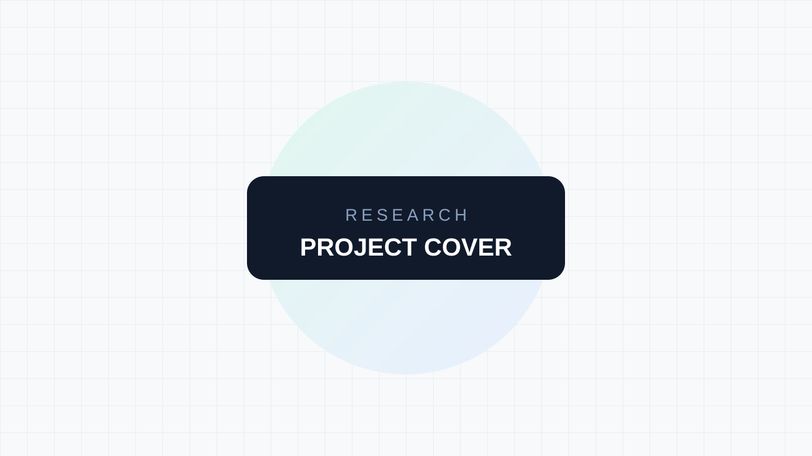

# 项目名称

> 一句话说明项目解决的问题，以及它为什么值得研究。

## 项目信息

- 原仓库：<https://github.com/owner/repository>
- 在线演示：暂无
- 研究状态：待研究
- 主要技术：待补充
- 最后更新：YYYY-MM-DD

## 为什么关注

说明发现项目的背景、它的独特之处，以及本次研究希望回答的问题。

## 核心能力

- 能力一：待补充。
- 能力二：待补充。
- 能力三：待补充。

## 设计与实现

记录架构、关键模块、重要数据流和有代表性的实现选择。引用代码时注明原文件路径与对应版本或 commit。

## 本地运行与验证

记录实际验证过的环境、命令、结果，以及与上游文档不一致的地方。不要把尚未执行的步骤写成已验证结论。

## 可复用的启发

总结可以迁移到其他项目的模式、实现技巧或产品思路。

## 局限与边界

记录使用成本、已知限制、适用场景，以及仍待确认的问题。

## 图片说明

图片的来源、许可与详细文字说明统一记录在 [images/README.md](images/README.md)。

## 参考资料

- [项目 README](https://github.com/owner/repository)
